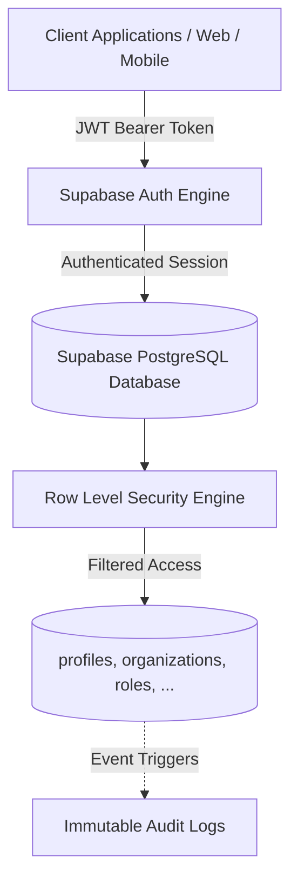

# Hiren Beyond — Backend Architecture & Foundation

## Executive Summary

**Hiren Beyond** is an AI-powered global career and recruitment ecosystem designed to connect candidates, recruiters, agency teams, and client organizations across the globe.

To achieve enterprise-grade scalability, security, and global compliance, the backend foundation is built natively upon **Supabase PostgreSQL**. This architecture enforces data isolation, role-based access controls, and auditability directly at the database engine tier through Row Level Security (RLS) and schema-level constraints.

---

## Core Architectural Pillars



### 1. Supabase as the Single Source of Truth
- **No Mock Repositories or Ephemeral Backends**: All persistent domain models, memberships, and logs reside inside Supabase PostgreSQL.
- **Declarative Migration Discipline**: Every structural modification is stored in version-controlled migration files within `supabase/migrations/`.
- **Database-Enforced Business Rules**: Crucial constraints (unique keys, foreign key cascades/restrictions, check constraints, immutable triggers) are enforced at the database layer rather than relying on application code.

### 2. Multi-Tenant Architecture
- **Tenant Boundaries**: The `organizations` table acts as the fundamental tenant boundary. An organization may represent Hiren Beyond Platform itself, a recruitment agency, a client company, an external partner, or a specialized talent team.
- **Tenant Membership**: Users link to organizations via `organization_members`, which establishes their scoped role and permission matrix.
- **Tenant Isolation**: Row Level Security (RLS) ensures that queries executed by an organization's staff cannot read or write data belonging to another tenant. Cross-tenant leakage is architecturally prohibited at the SQL engine level.

### 3. Authentication & Profile Linkage
- **Decoupled User Identity**: User authentication (passwords, MFA, Google/Apple OAuth) is managed by Supabase Auth (`auth.users`).
- **Profile Synchronization**: The `profiles` table references `auth.users(id)` with `ON DELETE CASCADE`.
- **Automated Lifecycle**: The database trigger `on_auth_user_created` automatically provisions a public profile upon user registration, synchronizing metadata such as email, full name, and avatar URL.
- **Credential Safety**: No passwords, access tokens, or sensitive hashes are ever stored in public application tables.

### 4. Role-Based Access Control (RBAC)
- The platform defines 7 standard system roles (`platform_admin`, `platform_operations`, `recruiter_manager`, `recruiter`, `client_admin`, `client_reviewer`, `candidate`).
- Permissions are represented as discrete capability tokens (e.g., `organizations.manage`, `jobs.read`, `applications.manage`).
- Helper functions evaluate permissions dynamically (`public.has_org_permission(...)`), enabling easy extension for custom permissions in future phases without rewriting RLS policies.

### 5. Audit Logging Foundation
- The `audit_logs` table records significant system, compliance, and user actions.
- Audit logs are **append-only**: non-admin users cannot alter (`UPDATE`) or erase (`DELETE`) log records.
- Access to audit logs is scoped to organization administrators (for their own tenant) and platform administrators (globally).

---

## Project Structure Overview

```text
Backend Project/
├── .env.example
├── README.md
├── docs/
│   ├── backend-foundation.md
│   ├── database-schema.md
│   ├── roles-and-permissions.md
│   ├── security-and-rls.md
│   ├── supabase-setup.md
│   └── verify-foundation.sql
└── supabase/
    ├── config.toml
    └── migrations/
        ├── 20260915000100_hiren_beyond_foundation.sql
        └── 20260915000200_hiren_beyond_seed.sql
```
