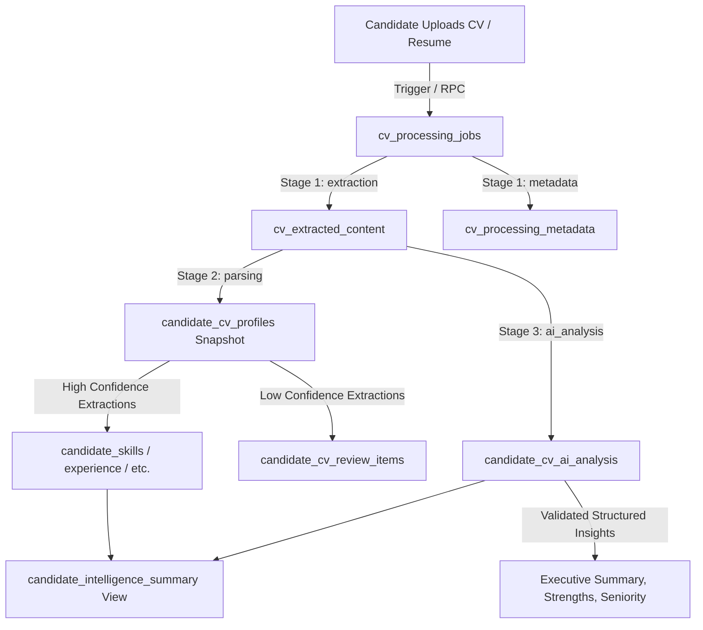

# Hiren Beyond — Task 05: CV Processing, AI CV Analysis & Structured Candidate Intelligence

## 1. Domain & Architecture Overview

Task 05 establishes the foundational backend engine for transforming unstructured candidate CV documents (PDF, DOCX) into structured, queryable, versioned, and AI-enriched candidate intelligence for the **Hiren Beyond** global career and recruitment platform.

### Core Architecture Philosophy
1. **Documents Are Inputs, Not Data**: A CV is not merely a static file stored in a bucket; it is an intake vector that feeds an idempotent processing pipeline.
2. **Strict Provenance & Verification**: Every extracted data point (skill, experience, education, language, certification) records its source, source document, extraction confidence score, and human verification status.
3. **Immutability of Human Truth**: AI extraction models and parsers will never silently overwrite or downgrade human-entered or recruiter-verified data.
4. **Historical Snapshot Integrity**: Applications preserve their frozen resume snapshot at time of application; uploading an updated CV produces a new version without altering past application records.
5. **Model-Agnostic Intelligence**: Analysis schemas, prompts, and inference outputs are decoupled from any specific LLM provider, with validation barriers ensuring malformed JSON outputs never corrupt candidate profiles.



---

## 2. Pipeline Stages & State Machine

The pipeline transitions sequentially across five discrete stages managed by `cv_processing_jobs`:

| Stage | Allowed Statuses | Purpose |
|---|---|---|
| `queued` | `queued` | Job created, waiting for worker pickup. Exponential retry backoff active if previously attempted. |
| `extraction` | `processing`, `completed`, `failed` | Raw text extraction from PDF/DOCX. Generates SHA-256 checksum, character counts, and extracts body text. |
| `parsing` | `processing`, `completed`, `failed` | Structured parsing of sections (experience, education, skills). Populates `candidate_cv_profiles`. |
| `ai_analysis` | `processing`, `completed`, `failed` | Model-agnostic LLM extraction. Generates executive summary, strengths, gaps, seniority, and recommendations. |
| `normalization` | `completed`, `needs_review`, `failed` | Skill taxonomy normalization, confidence filtering, and populating review queue for ambiguous items. |

### Failure Handling & Retry Logic
- **Max Retries**: Default 3 retries per job.
- **Exponential Backoff**: `next_retry_at = now() + (interval '30 seconds' * (2 ^ retry_count))`.
- **Terminal States**: `completed`, `failed` (exhausted retries), `cancelled`.
- **Non-Fatal Review State**: `needs_review` allows manual human intervention without marking the entire pipeline as broken.

---

## 3. Database Schema Reference

### 3.1 New Tables

#### `cv_processing_jobs`
Tracks asynchronous execution, stage progression, retries, and worker heartbeats.
- `id` (UUID PK): Unique identifier.
- `candidate_document_id` (UUID FK → `candidate_documents.id`): Source document.
- `candidate_id` (UUID FK → `candidates.id`): Candidate owner.
- `pipeline_stage` (TEXT): `queued`, `extraction`, `parsing`, `ai_analysis`, `normalization`, `completed`.
- `status` (TEXT): `queued`, `processing`, `completed`, `failed`, `needs_review`, `cancelled`.
- `retry_count` / `max_retries`: Execution retry thresholds.
- `idempotency_key` (TEXT UNIQUE): Deduplication key `doc_{id}_v{version}_{type}`.
- `error_code` / `error_message` / `error_details` (JSONB): Structured diagnostics.

#### `cv_extracted_content`
Stores extracted raw and cleaned text from documents.
- `id` (UUID PK)
- `candidate_document_id` (UUID FK)
- `candidate_id` (UUID FK)
- `extraction_version` (INT): Monotonically increasing version.
- `raw_text` (TEXT): Full unaltered extracted text.
- `cleaned_text` (TEXT): Sanitized text without control characters or formatting noise.
- `word_count` / `character_count`: Volume metrics.
- `extraction_method` (TEXT): `pdf_parser`, `ocr`, `doc_converter`.
- `UNIQUE (candidate_document_id, extraction_version)`

#### `cv_processing_metadata`
Document quality and diagnostic telemetrics.
- `id` (UUID PK)
- `candidate_document_id` (UUID FK)
- `file_checksum_sha256` (TEXT): Document integrity digest.
- `page_count` (INT): Extracted page count.
- `is_scanned_image` / `ocr_applied` (BOOLEAN): Processing methodology flags.
- `language_detected` / `language_confidence`: Text linguistic classification.
- `parsing_quality_score` (NUMERIC 0.00-1.00): Parser confidence metric.
- `warnings` (JSONB): Structured non-fatal warnings (e.g. missing sections, encrypted fonts).

#### `candidate_cv_profiles`
Versioned structured profile snapshot extracted directly from a specific CV.
- `id` (UUID PK)
- `candidate_document_id` (UUID FK)
- `candidate_id` (UUID FK)
- `version` (INT): CV profile iteration.
- `is_active` (BOOLEAN): Flag indicating if this snapshot is the active candidate representation.
- `headline` / `executive_summary` / `current_title`: Extracted positioning.
- `total_years_experience` / `highest_education_level`: Aggregated metrics.
- `extracted_skills` / `extracted_experience` / `extracted_education` / `extracted_certifications` / `extracted_languages` (JSONB): Full structured datasets.
- `UNIQUE (candidate_document_id, version)`

#### `candidate_cv_ai_analysis`
Model-agnostic AI qualitative and quantitative assessment.
- `id` (UUID PK)
- `candidate_document_id` (UUID FK)
- `candidate_id` (UUID FK)
- `analysis_version` (INT): Analysis run counter.
- `model_provider` / `model_name` / `prompt_version`: Model traceability.
- `executive_summary` (TEXT): High-level candidate synthesis.
- `strengths` / `weaknesses` / `key_achievements` (TEXT[]): Categorized bullet points.
- `suggested_job_titles` / `detected_domains` / `detected_tools` (TEXT[]): Taxonomy tagging.
- `seniority_level` (TEXT): `intern`, `junior`, `mid`, `senior`, `lead`, `principal`, `director`, `executive`.
- `raw_analysis_payload` (JSONB): Complete validated model response.
- `UNIQUE (candidate_document_id, analysis_version, prompt_version, model_name)`

#### `candidate_cv_review_items`
Human-in-the-loop review queue for ambiguous or low-confidence extractions.
- `id` (UUID PK)
- `candidate_id` / `candidate_document_id` (UUID FKs)
- `item_type` (TEXT): `skill`, `experience`, `education`, `certification`, `language`.
- `extracted_value` (JSONB): Candidate data proposition.
- `confidence_score` (NUMERIC): Extracted confidence.
- `flag_reason` (TEXT): `low_confidence`, `ambiguous_title`, `unrecognized_institution`, `conflict_with_verified`.
- `review_status` (TEXT): `pending`, `accepted`, `rejected`, `modified`.
- `reviewed_by` / `reviewed_at` / `resolution_notes`: Audit trail.

---

### 3.2 Existing Table Extensions

All existing candidate sub-tables have been extended non-destructively:

| Table | Added Columns | Details |
|---|---|---|
| `candidate_skills` | `source_document_id`, `confidence`, `verification_status` | Links skill to source CV, stores 0.00-1.00 confidence, sets `unverified` vs `human_verified`. |
| `candidate_languages` | `source_document_id`, `confidence`, `verification_status` | Links language to source CV with confidence and verification status. |
| `candidate_experience` | `source`, `source_document_id`, `confidence`, `verification_status`, `industry`, `responsibilities`, `extracted_achievements` | Provenance tracking, industry classification, responsibilities array, and achievements array. |
| `candidate_education` | `source`, `source_document_id`, `confidence`, `verification_status`, `education_level` | Provenance tracking, standardized education level code. |
| `candidate_certifications` | `source`, `source_document_id`, `confidence`, `verification_status` | Provenance tracking and extraction confidence. |

---

## 4. Inviolable Guard Triggers

To uphold the core principle that **AI never overwrites human truth**, PostgreSQL `BEFORE UPDATE OR DELETE` triggers enforce schema-level immutability:

- `guard_human_verified_skill()`
- `guard_human_verified_language()`
- `guard_human_verified_experience()`

```sql
-- Prevents AI extractions from downgrading verified entries:
IF OLD.verification_status = 'human_verified' AND NEW.verification_status != 'human_verified' THEN
    RAISE EXCEPTION 'Cannot downgrade human_verified status on candidate item'
        USING ERRCODE = 'HB001';
END IF;
```

---

## 5. Security & Row Level Security (RLS)

All 6 new tables have Row Level Security enabled (`ALTER TABLE ... ENABLE ROW LEVEL SECURITY`).

### Access Matrix

| Table | Candidate (Owner) | Recruiter (Org Member) | Public / Anon |
|---|---|---|---|
| `cv_processing_jobs` | SELECT (own jobs) | SELECT (via `has_candidate_read_access`) | None |
| `cv_extracted_content` | SELECT (own documents) | SELECT (via `has_candidate_read_access` + `cv.view_extracted`) | None |
| `cv_processing_metadata` | SELECT (own documents) | SELECT (via `has_candidate_read_access`) | None |
| `candidate_cv_profiles` | SELECT (own profiles) | SELECT (via `has_candidate_read_access`) | None |
| `candidate_cv_ai_analysis` | SELECT (own analysis) | SELECT (via `has_candidate_read_access` + `cv.view_analysis`) | None |
| `candidate_cv_review_items`| SELECT (own items) | SELECT / UPDATE (via `has_candidate_manage_access`) | None |

> [!IMPORTANT]
> Raw write access (`INSERT`, `UPDATE`, `DELETE`) to extracted and AI analysis tables is locked to `service_role` and `SECURITY DEFINER` stored procedures. API clients cannot forge or inject arbitrary extraction records.

---

## 6. Secure Candidate Intelligence Summary View

The view `candidate_intelligence_summary` is defined with `WITH (security_invoker = true)`.

- Enforces the requesting user's RLS permissions automatically.
- Exposes normalized candidate career synthesis, active skills, languages, experience metrics, and latest AI analysis status.
- **Redacts Sensitive PII**: Does NOT expose raw text, storage paths, or sensitive identity tokens.

---

## 7. Stored Procedures (RPC API)

The following `SECURITY DEFINER` functions provide atomic, secure operations for edge workers:

1. `queue_cv_processing(p_candidate_document_id, p_job_type, p_provider, p_parser_version)`
   - Checks document existence and creates an idempotent job in `queued` status.
2. `advance_cv_pipeline_stage(p_job_id, p_stage, p_status, p_metadata, p_error_code, p_error_message)`
   - Advances stage, manages execution timing, and implements exponential backoff retries on failure.
3. `save_cv_extracted_text(p_candidate_document_id, p_job_id, p_raw_text, p_cleaned_text, p_word_count, p_char_count, p_extraction_method, p_metadata)`
   - Atomic upsert of raw extracted text and companion processing metadata.
4. `save_cv_ai_analysis(p_candidate_document_id, p_job_id, p_model_provider, p_model_name, p_prompt_version, p_analysis_payload)`
   - Enforces JSON validation. If payload is invalid or empty, fails the job cleanly without polluting the DB.
5. `get_cv_processing_status(p_candidate_document_id)`
   - Candidate-facing status readout returning current stage, retry count, and completion state.

---

## 8. AI Abstraction & Environment Configuration

The backend contains zero vendor lock-in. Any AI model provider (OpenAI, Anthropic, Google Gemini, Ollama, DeepSeek) can be plugged into background processing workers.

### Worker Environment Variables
```ini
# Supabase Backend Configuration
SUPABASE_URL=https://pthkmkwrqjyseonysjzu.supabase.co
SUPABASE_SERVICE_ROLE_KEY=your_service_role_key_here

# AI Model Provider Configuration (Kept in Edge/Worker Environment ONLY)
AI_DEFAULT_PROVIDER=openai
AI_DEFAULT_MODEL=gpt-4o
AI_PROMPT_VERSION=v1.2.0

# Optional Provider Keys
OPENAI_API_KEY=sk-...
ANTHROPIC_API_KEY=sk-ant-...
GEMINI_API_KEY=AIza...
```

> [!CAUTION]
> AI provider API keys MUST NEVER be stored in PostgreSQL tables, migrations, or frontend repositories. They reside exclusively in secure secret stores (Supabase Vault or Edge Function secrets).

---

## 9. Verification & Audit

To verify the installation on the remote Supabase database:

```bash
# Check migration status
npx supabase migration list

# Run the automated verification suite
npx supabase db query -f docs/backend/verify-cv-intelligence.sql --linked
```
