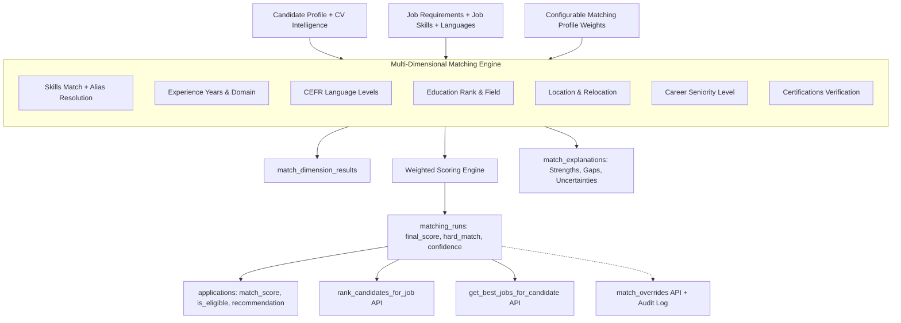

# Hiren Beyond — Task 06: Candidate ↔ Job Matching Engine, Match Score, Explanation & Ranking

## 1. Executive Summary & Philosophy

Task 06 establishes the **Candidate ↔ Job Matching Engine** for the **Hiren Beyond** global career and recruitment platform.

The system replaces opaque, arbitrary "AI match percentages" with a **multi-dimensional, explainable, deterministic, and auditable** scoring architecture.

### Core Guiding Principles
1. **Explainable Over Black-Box**: Every score is composed of verifiable dimension scores (Skills, Experience, Languages, Education, Location, Workplace/Employment, Career Level, Certifications).
2. **Hard Requirement Disqualification Without Score Loss**: Failing a mandatory requirement (e.g. required language level or mandatory certification) triggers `hard_match = false` with explicit failure reasons, while preserving the numerical weighted score. This lets recruiters distinguish between fundamentally disqualified candidates and strong candidates with minor gaps.
3. **Safe Uncertainty Model**: Missing or unconfirmed candidate data is classified as `unknown` rather than negative disqualification (e.g., if a candidate has no language record, it is reported as `unknown` rather than "cannot speak English").
4. **Immutable Versioning**: Every matching run generates a distinct, immutable `matching_runs` record with engine and profile versions (`engine_version`, `matching_profile_version`). Past results are never overwritten when new matching runs execute.
5. **Human Recruiter Overrides with Audit Trail**: Authorized recruiters can manually override scores or recommendations, requiring a mandatory justification (min 10 characters), recording the original score and actor, and writing to the platform `audit_logs`.



---

## 2. Mathematical Score Formula

The match score is calculated as a normalized weighted sum across all active dimensions:

$$\text{Final Score} = \frac{\sum_{i=1}^{N} (\text{Score}_i \times \text{Weight}_i)}{\sum_{i=1}^{N} \text{Weight}_i}$$

Where:
- $\text{Score}_i \in [0, 100]$: The dimension evaluation score.
- $\text{Weight}_i \ge 0$: The configured weight for dimension $i$ from `matching_profiles`.
- Normalized to $[0, 100]$ with 2 decimal places precision.

### Default Dimension Weights (`matching_profiles`)
| Dimension | Default Weight | Percentage | Evaluation Criteria |
|---|---|---|---|
| **Skills** | 35 | 35% | Exact, normalized, and alias matches against required & optional job skills |
| **Experience** | 25 | 25% | Recorded years of experience vs job seniority requirements |
| **Languages** | 15 | 15% | CEFR level comparisons (A1 to Native) against required minimum levels |
| **Education** | 10 | 10% | Highest degree level (Bachelors, Masters, PhD) and field alignment |
| **Location** | 5 | 5% | Remote compatibility, country/city match, and relocation preferences |
| **Career Level** | 5 | 5% | Aligned seniority level (Entry to Executive) |
| **Certifications** | 5 | 5% | Required and preferred certifications verification |
| **Total** | **100** | **100%** | |

---

## 3. Dimension Evaluation Logic

### 3.1 Skills Matching & Normalization
- Employs `skill_aliases` catalog and `normalize_skill_text(p_skill)` to resolve variants:
  * `JS`, `Javascript`, `ecmascript` $\to$ `JavaScript`
  * `ReactJS`, `React.js` $\to$ `React`
  * `Node`, `NodeJS` $\to$ `Node.js`
  * `K8s` $\to$ `Kubernetes`
  * `AWS`, `Amazon Web Services` $\to$ `AWS`
- Computes proportion of matched skills: $\text{Score} = (\text{Matched Skills} / \text{Required Skills}) \times 100$.
- **Hard Filter**: Missing any skill marked `is_required = true` flags `hard_match = false` and appends to `hard_failure_reasons` and `missing_required_items`.

### 3.2 Experience Matching
- Computes total candidate years from `candidate_experience` date ranges and `candidate_profiles.years_of_experience`.
- Maps job `experience_level` to baseline years (Entry: 0, Junior: 1, Mid: 3, Senior: 5, Lead: 7, Director/Executive: 10).
- If $\text{Years}_{\text{candidate}} \ge \text{Years}_{\text{required}}$, Score = 100, Status = `matched`.
- If $\text{Years}_{\text{candidate}} < \text{Years}_{\text{required}}$, Score = $(\text{Years}_{\text{cand}} / \text{Years}_{\text{req}}) \times 100$, Status = `partially_matched`.
- If no experience recorded, Score = 50, Status = `unknown` (uncertainty flagged).

### 3.3 Language Matching & CEFR Levels
- Uses `get_cefr_level_numeric(p_level)` mapping:
  * A1 (Beginner) = 1, A2 (Pre-Intermediate) = 2, B1 (Intermediate) = 3, B2 (Upper-Intermediate) = 4, C1 (Advanced) = 5, C2 (Mastery) = 6, Native/Bilingual = 7.
- If Candidate Level $\ge$ Required Level $\to$ Score = 100, Status = `matched`.
- If Candidate Level $<$ Required Level $\to$ Partial score, Status = `partially_matched`.
  * If mandatory: triggers `hard_match = false` and adds to `missing_required_items`.
- If candidate has no record of the required language: Status = `unknown` (or hard failure if mandatory).

### 3.4 Education Matching
- Maps degrees via `get_education_level_numeric(p_degree)`:
  * High School = 1, Diploma/Vocational = 2, Bachelor's (B.Sc, B.A, B.Eng) = 3, Master's (M.Sc, MBA, M.A) = 4, Doctorate (Ph.D) = 5.
- Tertiary degree (Level $\ge$ 3) achieves Score = 100.
- Missing educational records yield Status = `unknown`.

### 3.5 Location & Workplace Matching
- If `workplace_type = 'remote'`: Score = 100, Status = `matched` (universal candidate compatibility).
- If `workplace_type IN ('onsite', 'hybrid')`:
  * Candidate in same country $\to$ Score = 100, Status = `matched`.
  * Candidate willing to relocate (`willing_to_relocate = true`) $\to$ Score = 90, Status = `partially_matched`.
  * Candidate country missing $\to$ Score = 50, Status = `unknown`.
  * Different country with no relocation preference $\to$ Score = 30, Status = `not_matched`.

### 3.6 Certifications Matching
- Cross-references certifications in `job_requirements` (`requirement_type = 'certification'`) with `candidate_certifications`.
- Mandatory certification missing $\to$ `hard_match = false`, added to `missing_required_items`.

---

## 4. Database Schema Reference

### 4.1 New Tables

| Table | Description |
|---|---|
| `matching_profiles` | Versioned dimension weights and threshold rules per organization or globally |
| `match_criteria` | Per-job custom requirements or criterion weight adjustments |
| `skill_aliases` | Taxonomy mapping for canonical skill matching |
| `matching_runs` | Immutable, versioned evaluation runs between candidates and jobs |
| `match_dimension_results` | Granular multi-dimensional evaluation results, evidence, and gaps |
| `match_explanations` | Structured narrative explanations (strengths, gaps, uncertainties, recommendations) |
| `match_overrides` | Human recruiter score and recommendation overrides with audit logging |

### 4.2 Seeded Data
- **Global Default Matching Profile**: `00000000-0000-0000-0000-000000000001` with balanced 7-dimension weights.
- **Skill Aliases**: 35+ canonical mappings covering major frontend, backend, devops, database, and systems technologies.
- **Permissions Added**: `matching.view`, `matching.run`, `matching.override`, `matching.configure` mapped to roles `platform_admin`, `platform_operations`, `recruiter_manager`, `recruiter`.

---

## 5. Stored Procedures (RPC API)

### 1. `calculate_candidate_job_match`
```sql
calculate_candidate_job_match(
    p_candidate_id UUID,
    p_job_id UUID,
    p_application_id UUID DEFAULT NULL,
    p_matching_profile_id UUID DEFAULT NULL,
    p_engine_version TEXT DEFAULT 'v1.0.0'
) RETURNS UUID
```
- Performs atomic evaluation across all dimensions.
- Inserts `matching_runs`, `match_dimension_results`, `match_explanations`.
- If `p_application_id` is supplied: updates `applications.match_score`, `applications.match_score_breakdown`, `applications.is_eligible = hard_match`, `applications.ai_recommendation = recommendation`.
- Records audit log `matching_run_completed`.

### 2. `rank_candidates_for_job`
```sql
rank_candidates_for_job(
    p_job_id UUID,
    p_limit INT DEFAULT 20,
    p_offset INT DEFAULT 0,
    p_hard_match_only BOOLEAN DEFAULT false,
    p_min_score NUMERIC DEFAULT 0,
    p_matching_profile_id UUID DEFAULT NULL
) RETURNS TABLE (...)
```
- Enforces organization-level permissions (`applications.read` or `jobs.manage`).
- Returns candidates ordered by `final_score DESC, hard_match DESC, confidence DESC`.

### 3. `get_best_jobs_for_candidate`
```sql
get_best_jobs_for_candidate(
    p_candidate_id UUID,
    p_limit INT DEFAULT 10,
    p_offset INT DEFAULT 0,
    p_min_score NUMERIC DEFAULT 50
) RETURNS TABLE (...)
```
- Candidate-facing recommendation reader.
- Filters strictly for active, public, published jobs.

### 4. `override_match_score`
```sql
override_match_score(
    p_matching_run_id UUID,
    p_override_type TEXT,
    p_override_score NUMERIC,
    p_reason TEXT
) RETURNS UUID
```
- Requires at least 10 characters of explanation.
- Preserves original score in `match_overrides`.
- Updates `matching_runs.final_score` and `applications.match_score`.
- Writes `manual_match_override` event to `audit_logs`.

---

## 6. Security & Row Level Security (RLS)

All 7 matching tables enforce strict Row Level Security (`ALTER TABLE ... ENABLE ROW LEVEL SECURITY`):

- **Candidates**: Can only read matching runs and explanations where `candidate_id` belongs to them. Cannot view other candidates or internal recruiter ranking configurations.
- **Recruiters**: Can view runs and dimension results for jobs belonging to their organization or candidates they have read access to. Can execute manual overrides only with `applications.manage` or `matching.override` permission.
- **Anonymous**: Zero access.

---

## 7. Migration & Deployment Details

- **Migration File**: [`supabase/migrations/20260915000700_matching_engine.sql`](file:///e:/New%20Downloads/Backend%20Project/supabase/migrations/20260915000700_matching_engine.sql) (58,870 bytes)
- **Deployment Status**: Applied to remote Supabase (`pthkmkwrqjyseonysjzu`, region `eu-west-1`).
- **Sync Command**: `npx supabase db push` (Exit Code 0).
- **Verification Script**: [`docs/backend/verify-matching-engine.sql`](file:///e:/New%20Downloads/Backend%20Project/docs/backend/verify-matching-engine.sql)
- **End-to-End Test Suite**: [`docs/backend/test-matching-scenarios.sql`](file:///e:/New%20Downloads/Backend%20Project/docs/backend/test-matching-scenarios.sql)
