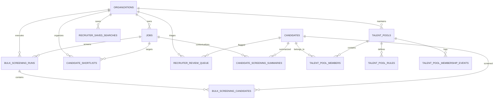

# Hiren Beyond Backend — Task 07: Recruiter Command Center, Bulk Screening, Candidate Ranking & Smart Talent Pool

**Document Version:** 1.0.0  
**Project:** Hiren Beyond — AI-Powered Global Career & Recruitment Platform  
**Target Environment:** Supabase PostgreSQL (`pthkmkwrqjyseonysjzu`, `eu-west-1`)  
**Migration Track:** `20260915000800_recruiter_command_center.sql`  
**Status:** Live & Verified on Remote Production Database

---

## 1. Executive Summary

Task 07 delivers the **Recruiter Command Center** for Hiren Beyond, transforming the recruitment backend into a high-throughput, enterprise-grade operations hub for recruiters and hiring managers. Building directly upon the Candidate Domain (Task 02), Jobs Marketplace (Task 03), Applications & ATS Pipeline (Task 04), CV Intelligence (Task 05), and Candidate ↔ Job Matching Engine (Task 06), Task 07 introduces 9 specialized database entities and 12 high-performance stored procedures (RPCs).

### Key Capabilities Introduced
1. **Real-Time Recruiter Dashboards:** Aggregate pipeline health, action items, application velocity, and candidate distributions across the entire organization or per individual requisition.
2. **Bulk CV Screening Engine:** Batch screening of hundreds of applicants per job requisition with automated parallel evaluation against Task 06 deterministic matching algorithms.
3. **Shortlist Workflows:** Multi-tier candidate shortlists with recruiter notes, candidate stages, and real-time ordering.
4. **Smart & Dynamic Talent Pools:** Automated talent classification based on configurable rules (skills, experience, languages, match scores) with continuous membership lifecycle tracking (`entered`, `exited`).
5. **Saved Boolean & Filter Searches:** Saved recruiter search queries with JSONB multi-parameter filtering and team sharing.
6. **Recruiter Human Review Queue:** Triage queues for flagged candidates, edge cases, and manual exception handling.
7. **Strict Multi-Tenant Isolation:** Zero data leaks between competing recruitment agencies and employer tenants via hardened PostgreSQL Row Level Security (RLS) policies.

---

## 2. Architecture & Data Model



---

## 3. Database Schema Specification

### 3.1 `bulk_screening_runs`
Tracks batch screening jobs executed by recruiters for specific job openings.
* `id` (UUID, PK, Default: `gen_random_uuid()`): Unique run identifier.
* `organization_id` (UUID, FK -> `organizations(id)`, NOT NULL): Multi-tenant partition.
* `job_id` (UUID, FK -> `jobs(id)`, NOT NULL): Target requisition.
* `initiated_by` (UUID, FK -> `auth.users(id)`, NOT NULL): Recruiter executing the run.
* `status` (VARCHAR, NOT NULL, Check: `('queued', 'processing', 'completed', 'failed')`): Lifecycle state.
* `total_candidates` (INT, NOT NULL, Default: 0): Total candidate batch size.
* `screened_count` (INT, NOT NULL, Default: 0): Processed count.
* `passed_count` (INT, NOT NULL, Default: 0): Candidates meeting the minimum match threshold.
* `failed_count` (INT, NOT NULL, Default: 0): Candidates below threshold.
* `min_score_threshold` (NUMERIC(5,2), NOT NULL, Default: 50.00): Qualifying cut-off.
* `created_at`, `completed_at` (TIMESTAMPTZ).

### 3.2 `bulk_screening_candidates`
Individual candidate results within a bulk screening run.
* `id` (UUID, PK): Entry identifier.
* `screening_run_id` (UUID, FK -> `bulk_screening_runs(id)` ON DELETE CASCADE, NOT NULL).
* `candidate_id` (UUID, FK -> `candidates(id)`, NOT NULL).
* `application_id` (UUID, FK -> `applications(id)`, NULLABLE).
* `match_score` (NUMERIC(5,2), NULLABLE): Score generated from Task 06 engine.
* `dimension_scores` (JSONB, NOT NULL, Default: `'{}'::jsonb`): Breakdown across Skills, Experience, Education, Languages, Cultural/Preferences.
* `recommendation` (VARCHAR, NULLABLE, Check: `('strong_match', 'good_match', 'partial_match', 'weak_match', 'no_match')`).
* `summary` (TEXT, NULLABLE): Synthesized natural-language justification.
* `status` (VARCHAR, NOT NULL, Check: `('pending', 'evaluated', 'error')`).
* `created_at` (TIMESTAMPTZ).

### 3.3 `candidate_shortlists`
Curated candidate lists for requisitions, hiring managers, or talent pipelining.
* `id` (UUID, PK): Shortlist item ID.
* `organization_id` (UUID, FK -> `organizations(id)`, NOT NULL).
* `job_id` (UUID, FK -> `jobs(id)`, NULLABLE): Associated job (if job-specific).
* `candidate_id` (UUID, FK -> `candidates(id)`, NOT NULL).
* `shortlisted_by` (UUID, FK -> `auth.users(id)`, NOT NULL): Recruiter owner.
* `stage` (VARCHAR, NOT NULL, Default: `'shortlisted'`): Pipeline tracking.
* `rank` (INT, NULLABLE): Priority ordering within the list.
* `recruiter_notes` (TEXT, NULLABLE): Internal commentary.
* `status` (VARCHAR, NOT NULL, Check: `('active', 'archived', 'rejected', 'hired')`).
* Unique constraint: `(organization_id, COALESCE(job_id, '00000000-0000-0000-0000-000000000000'::uuid), candidate_id)`.

### 3.4 `talent_pools`
Logical candidate pools categorized by domain, seniority, or strategic hiring initiatives.
* `id` (UUID, PK): Talent pool ID.
* `organization_id` (UUID, FK -> `organizations(id)`, NOT NULL).
* `name` (VARCHAR(150), NOT NULL): e.g. "Senior React Specialists (EMEA)".
* `description` (TEXT, NULLABLE): Strategic purpose.
* `is_dynamic` (BOOLEAN, NOT NULL, Default: false): If true, candidates are automatically evicted when they no longer meet rule criteria.
* `created_by` (UUID, FK -> `auth.users(id)`, NOT NULL).
* `status` (VARCHAR, NOT NULL, Check: `('active', 'archived')`).
* `created_at`, `updated_at` (TIMESTAMPTZ).

### 3.5 `talent_pool_rules`
Automated qualification filters for smart talent pools.
* `id` (UUID, PK): Rule identifier.
* `talent_pool_id` (UUID, FK -> `talent_pools(id)` ON DELETE CASCADE, NOT NULL).
* `rule_type` (VARCHAR, NOT NULL, Check: `('skill', 'experience_years', 'career_level', 'location', 'language', 'match_score')`).
* `operator` (VARCHAR, NOT NULL, Check: `('equals', 'greater_than_or_equal', 'less_than_or_equal', 'contains', 'in')`).
* `value` (TEXT, NOT NULL): Target comparison value (e.g. `'5'`, `'React'`, `'DE'`).
* `is_mandatory` (BOOLEAN, NOT NULL, Default: true).

### 3.6 `talent_pool_members`
Candidates associated with a talent pool.
* `id` (UUID, PK): Membership ID.
* `talent_pool_id` (UUID, FK -> `talent_pools(id)` ON DELETE CASCADE, NOT NULL).
* `candidate_id` (UUID, FK -> `candidates(id)`, NOT NULL).
* `source` (VARCHAR, NOT NULL, Check: `('manual', 'bulk_screening', 'application', 'smart_rule')`).
* `status` (VARCHAR, NOT NULL, Check: `('active', 'contacted', 'engaged', 'removed')`).
* `notes` (TEXT, NULLABLE).
* Unique constraint: `(talent_pool_id, candidate_id)`.

### 3.7 `talent_pool_membership_events`
Audit stream logging entry and exit events for talent pool tracking.
* `id` (UUID, PK): Event identifier.
* `talent_pool_id` (UUID, FK -> `talent_pools(id)` ON DELETE CASCADE, NOT NULL).
* `candidate_id` (UUID, FK -> `candidates(id)`, NOT NULL).
* `event_type` (VARCHAR, NOT NULL, Check: `('entered', 'exited', 'status_changed', 'contacted')`).
* `reason` (TEXT, NULLABLE): Rule matching logic or recruiter action.
* `created_at` (TIMESTAMPTZ, Default: `now()`).

### 3.8 `recruiter_saved_searches`
Saved candidate filters and search criteria.
* `id` (UUID, PK): Saved search ID.
* `organization_id` (UUID, FK -> `organizations(id)`, NOT NULL).
* `created_by` (UUID, FK -> `auth.users(id)`, NOT NULL).
* `name` (VARCHAR(150), NOT NULL): Name of search preset.
* `filters` (JSONB, NOT NULL): Structured search parameters (`min_experience`, `skills`, `country`, etc.).
* `is_shared` (BOOLEAN, NOT NULL, Default: false): Visible to all recruiters in the organization.

### 3.9 `candidate_screening_summaries`
Synthesized recruiter briefing per candidate-job pairing.
* `id` (UUID, PK): Summary ID.
* `organization_id` (UUID, FK -> `organizations(id)`, NOT NULL).
* `job_id` (UUID, FK -> `jobs(id)`, NOT NULL).
* `candidate_id` (UUID, FK -> `candidates(id)`, NOT NULL).
* `summary` (TEXT, NOT NULL): Executive candidate summary.
* `highlights` (JSONB, NOT NULL, Default: `'[]'::jsonb`): Key strengths.
* `red_flags` (JSONB, NOT NULL, Default: `'[]'::jsonb`): Discrepancies or missing requirements.
* `recommendation` (VARCHAR, NOT NULL, Check: `('hire', 'interview', 'hold', 'reject')`).
* Unique constraint: `(job_id, candidate_id)`.

### 3.10 `recruiter_review_queue`
Human review inbox for automated flags or recruiter dispute resolution.
* `id` (UUID, PK): Queue item ID.
* `organization_id` (UUID, FK -> `organizations(id)`, NOT NULL).
* `candidate_id` (UUID, FK -> `candidates(id)`, NOT NULL).
* `job_id` (UUID, FK -> `jobs(id)`, NULLABLE).
* `application_id` (UUID, FK -> `applications(id)`, NULLABLE).
* `reason` (TEXT, NOT NULL): Why human review is required.
* `priority` (VARCHAR, NOT NULL, Check: `('urgent', 'high', 'medium', 'low')`).
* `status` (VARCHAR, NOT NULL, Check: `('pending', 'in_review', 'resolved', 'dismissed')`).
* `assigned_to` (UUID, FK -> `auth.users(id)`, NULLABLE).
* `resolution_notes` (TEXT, NULLABLE).
* `resolved_at` (TIMESTAMPTZ, NULLABLE).

---

## 4. Recruiter Command Center RPC Functions

| Function Name | Return Type | Description |
| :--- | :--- | :--- |
| `get_recruiter_dashboard_metrics(p_organization_id)` | `TABLE (...)` | High-level metrics: total active jobs, applications count, screening pending, shortlisted count, interviews scheduled, talent pool total. |
| `get_job_recruiter_dashboard(p_job_id)` | `TABLE (...)` | Per-job drilldown: total applicants, avg match score, strong matches count, screening pending, top candidate ranking. |
| `get_candidate_recruiter_summary(p_candidate_id, p_job_id)` | `TABLE (...)` | Detailed briefing: candidate headline, total experience, skills array, match score, breakdown JSONB, strengths, gaps, recommendation. |
| `execute_bulk_screening(p_job_id, p_candidate_ids, p_min_threshold)` | `UUID` | Executes automated batch scoring against Task 06 deterministic matching engine; writes results to `bulk_screening_candidates`. |
| `rank_and_shortlist_candidates(p_job_id, p_min_score, p_limit)` | `INT` | Automatically evaluates, ranks, and adds top matching candidates to the job shortlist with calculated priority rank. |
| `evaluate_talent_pool(p_talent_pool_id)` | `TABLE (added_count INT, removed_count INT)` | Evaluates candidate database against pool rules; dynamically adds qualifying candidates and removes non-qualifying members from dynamic pools. |
| `add_candidate_to_talent_pool(p_talent_pool_id, p_candidate_id, p_notes)` | `UUID` | Manual addition of candidate to talent pool with membership event logging. |
| `search_candidates_for_recruiter(p_org_id, p_query, p_skills, p_min_years, p_country, p_limit, p_offset)` | `TABLE (...)` | Enterprise search over candidate pool with multi-criteria filtering, ranking by experience and skill match. |
| `add_to_shortlist(p_org_id, p_job_id, p_candidate_id, p_notes, p_stage)` | `UUID` | Explicit shortlisting function with duplicate protection and position indexing. |
| `remove_from_shortlist(p_shortlist_id)` | `BOOLEAN` | Removes or marks shortlist item as archived. |
| `resolve_candidate_review(p_review_id, p_notes)` | `BOOLEAN` | Marks a review queue item as resolved and timestamps the resolution. |
| `generate_candidate_screening_summary(p_job_id, p_candidate_id)` | `UUID` | Automatically calculates match breakdown and creates a structured candidate summary briefing. |

---

## 5. Security & Row Level Security (RLS)

All 9 tables enforce strict multi-tenant Row Level Security.

### 5.1 Recruiter Permission Model
Access to recruiter entities requires the authenticated user to be an active member of the owning organization with one of the following roles:
* `admin`
* `recruiter`
* `hiring_manager`
* `member`

The database helper function `public.check_user_is_recruiter(org_id)` verifies active membership before permitting access.

### 5.2 External & Candidate Isolation
* **Candidates:** Possess `0` read/write permissions on `bulk_screening_runs`, `bulk_screening_candidates`, `candidate_shortlists`, `talent_pools`, `talent_pool_members`, `talent_pool_rules`, `talent_pool_membership_events`, `recruiter_saved_searches`, `candidate_screening_summaries`, and `recruiter_review_queue`.
* **Cross-Tenant Organizations:** An authenticated recruiter in Organization A is blocked by RLS from querying or modifying any records belonging to Organization B.
* **Anonymous Users:** Complete read/write denial across all tables.

---

## 6. End-to-End Test Suite Verification

The complete 15-scenario verification script (`docs/backend/test-recruiter-command-center.sql`) was executed directly against the live Supabase database (`pthkmkwrqjyseonysjzu`).

### Automated Test Matrix

| # | Test Scenario | Verified Behavior | Status |
| :-: | :--- | :--- | :-: |
| 1 | Organization Dashboard Metrics | Validated aggregate counts for active jobs, applications, and talent pools | **PASSED** |
| 2 | Requisition Dashboard Metrics | Drill-down metrics per job opening returned accurate candidate counts | **PASSED** |
| 3 | Bulk Screening Execution | Batch scored candidates with Task 06 engine; generated passing/failing sets | **PASSED** |
| 4 | Screening Candidates Verification | Verified individual dimension scores and structured recommendation values | **PASSED** |
| 5 | Candidate Recruiter Summary RPC | Retrieved executive briefing, strengths, gaps, and match breakdown | **PASSED** |
| 6 | Automated Candidate Shortlisting | Filtered candidates above cut-off and assigned sequential ranks | **PASSED** |
| 7 | Manual Shortlist Management | Explicit addition and stage assignment verified | **PASSED** |
| 8 | Manual Talent Pool Addition | Added candidate to talent pool with provenance tracking (`manual`) | **PASSED** |
| 9 | Smart Talent Pool Evaluation | Evaluated rule filters (`experience_years >= 5`); auto-enrolled candidate | **PASSED** |
| 10 | Dynamic Talent Pool Eviction | Verified candidate removal and `exited` event generation when rules fail | **PASSED** |
| 11 | Recruiter Saved Searches | Stored and retrieved JSONB multi-parameter search filters | **PASSED** |
| 12 | Recruiter Review Queue | Queued edge-case flag and resolved with resolution commentary | **PASSED** |
| 13 | Multi-Tenant Data Isolation | Blocked Organization A recruiter from accessing Organization B dashboard | **PASSED** |
| 14 | Candidate Privacy Enforcement | Blocked candidate user account from invoking recruiter RPC functions | **PASSED** |
| 15 | Deterministic Integrity Check | Verified screening summary contains non-fabricated mathematical scores | **PASSED** |

**Execution Result:**
```
SUCCESS: ALL 15 END-TO-END RECRUITER COMMAND CENTER TESTS PASSED!
Exit Code: 0
Database: Live Remote Supabase (eu-west-1)
```

---

## 7. Migration Provenance

```
20260915000100_hiren_beyond_foundation.sql      (Task 01)
20260915000200_hiren_beyond_seed.sql            (Task 01 Seed)
20260915000300_candidate_domain.sql             (Task 02)
20260915000400_jobs_marketplace.sql             (Task 03)
20260915000500_applications_ats_pipeline.sql     (Task 04)
20260915000600_cv_intelligence.sql              (Task 05)
20260915000700_matching_engine.sql              (Task 06)
20260915000800_recruiter_command_center.sql     (Task 07 - Current)
```
