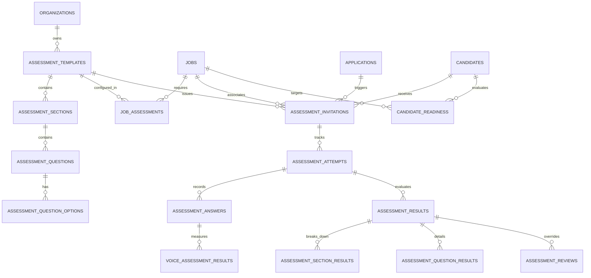

# Hiren Beyond Backend — Task 08: Assessments, Language/Voice Evaluation, Human Review & Candidate Readiness

**Document Version:** 1.0.0  
**Project:** Hiren Beyond — AI-Powered Global Career & Recruitment Platform  
**Target Environment:** Supabase PostgreSQL (`pthkmkwrqjyseonysjzu`, `eu-west-1`)  
**Migration Track:** `20260915000900_assessments_evaluation_readiness.sql`  
**Status:** Live & Verified on Remote Production Database

---

## 1. Executive Summary

Task 08 implements the complete **Assessment, Evaluation, and Candidate Readiness** subsystem for Hiren Beyond. In modern global recruitment, candidate qualification cannot be reduced to a single fixed interview workflow. Different roles demand distinct evaluation pipelines:
* **Call Center Roles:** Language Evaluation → Voice Assessment → Human Review → Readiness
* **Translation Roles:** Language Assessment → Translation Exercise → Human Review → Readiness
* **Technical Roles:** Coding/Technical Assessment → Human Review → Interview → Readiness
* **AI Training Roles:** CV Screening → Optional Micro-Assessment → Partner Referral / Direct

To power these workflows flexibly and securely, Task 08 delivers:
1. **14 Core Relational Tables:** Managing templates, versioning, sections, questions, protected answer keys, invitations, attempts, answers, results, voice evaluations, human reviews, and candidate readiness.
2. **3 Dedicated Private Storage Buckets:** `assessment-audio`, `assessment-video`, and `assessment-files` with strict RLS storage policies preventing unauthorized candidate access or public exposure.
3. **Deterministic & Weighted Scoring Engine:** Calculates authoritative mathematical scores based on configurable question points and section weights without hallucination risks.
4. **CEFR Language Integration:** Reuses CEFR proficiencies (`A1`–`C2`) to translate assessment scores into standardized international language frameworks.
5. **Voice Evaluation Pipeline:** Analyzes audio submissions for fluency, pronunciation, clarity, and overall score with provider-agnostic metadata and confidence thresholds.
6. **Human Review & AI Provenance:** Preserves the original AI evaluation and score permanently when a human reviewer overrides a result, stamping the evaluation method as `'hybrid'`.
7. **Dynamic Candidate Readiness Engine:** Real-time multi-factor evaluation of required job assessments, pass/fail status, and pending reviews, generating structured blocking reasons and candidate-friendly progress briefings.

---

## 2. Architecture & Data Model



---

## 3. Database Schema Specification

### 3.1 `assessment_templates`
Reusable assessment definitions supporting organization-specific or global platform templates.
* `id` (UUID, PK): Unique template identifier.
* `organization_id` (UUID, FK -> `organizations(id)`, NULLABLE): Owning organization (NULL for global platform templates).
* `created_by` (UUID, FK -> `auth.users(id)`, NULLABLE): Author user.
* `name` (VARCHAR(255), NOT NULL): e.g. "English Communication & Voice Assessment".
* `slug` (VARCHAR(255), NOT NULL): Unique URL-friendly slug.
* `description` (TEXT, NULLABLE): Purpose and instructions.
* `assessment_type` (VARCHAR(50), NOT NULL, Check: `('language', 'voice', 'technical', 'translation', 'general', 'ai_training', 'custom')`).
* `version` (INT, NOT NULL, Default: 1): Monotonically increasing version number.
* `status` (VARCHAR(50), NOT NULL, Default: `'draft'`, Check: `('draft', 'published', 'archived')`).
* `time_limit_minutes` (INT, NULLABLE): Maximum duration allowed for the attempt.
* `passing_score` (NUMERIC(5,2), Default: 70.00): Qualifying score threshold.
* `is_active` (BOOLEAN, NOT NULL, Default: true).
* `is_platform` (BOOLEAN, NOT NULL, Default: false): Indicates whether the template is a platform-wide standard.
* `configuration` (JSONB, NOT NULL, Default: `'{}'::jsonb`).
* Unique index: `(COALESCE(organization_id, '00000000-0000-0000-0000-000000000000'::uuid), slug, version)`.

### 3.2 `assessment_sections`
Logical modules within an assessment (e.g. Grammar, Vocabulary, Speaking, Pronunciation).
* `id` (UUID, PK): Section identifier.
* `assessment_template_id` (UUID, FK -> `assessment_templates(id)` ON DELETE CASCADE).
* `name` (VARCHAR(150), NOT NULL): Section name.
* `section_type` (VARCHAR(50), NOT NULL, Check: `('grammar', 'vocabulary', 'reading', 'listening', 'speaking', 'pronunciation', 'technical_knowledge', 'coding', 'translation', 'communication', 'custom')`).
* `sort_order` (INT, NOT NULL, Default: 0): Sequence in the assessment.
* `weight` (NUMERIC(5,2), NOT NULL, Default: 1.00): Percentage weight in final score calculation (e.g. 40.00 for Grammar, 60.00 for Speaking).

### 3.3 `assessment_questions`
Questions assigned to each section.
* `id` (UUID, PK): Question identifier.
* `assessment_section_id` (UUID, FK -> `assessment_sections(id)` ON DELETE CASCADE).
* `question_type` (VARCHAR(50), NOT NULL, Check: `('single_choice', 'multiple_choice', 'true_false', 'text', 'long_text', 'number', 'coding', 'translation', 'audio_response', 'video_response', 'file_upload')`).
* `question_text` (TEXT, NOT NULL): The prompt or problem statement.
* `instructions` (TEXT, NULLABLE): Specific guidance for the candidate.
* `difficulty` (VARCHAR(50), Default: `'medium'`, Check: `('easy', 'medium', 'hard', 'expert')`).
* `points` (NUMERIC(5,2), NOT NULL, Default: 1.00): Raw points allocated to this question.
* `is_required` (BOOLEAN, NOT NULL, Default: true).
* `sort_order` (INT, NOT NULL, Default: 0).
* `correct_answer` (TEXT, NULLABLE): Protected answer key stored server-side. Never exposed to candidate clients.

### 3.4 `assessment_question_options`
Selectable options for single/multiple choice questions.
* `id` (UUID, PK): Option identifier.
* `question_id` (UUID, FK -> `assessment_questions(id)` ON DELETE CASCADE).
* `option_text` (TEXT, NOT NULL): Text displayed to the user.
* `sort_order` (INT, NOT NULL, Default: 0).
* `points` (NUMERIC(5,2), Default: 0.00).
* `is_correct` (BOOLEAN, NOT NULL, Default: false): Protected server-side boolean. Never exposed to candidate queries.

### 3.5 `job_assessments`
Associates required or optional assessments with specific job requisitions.
* `id` (UUID, PK): Association identifier.
* `job_id` (UUID, FK -> `jobs(id)` ON DELETE CASCADE).
* `assessment_template_id` (UUID, FK -> `assessment_templates(id)` ON DELETE CASCADE).
* `required` (BOOLEAN, NOT NULL, Default: true).
* `sequence` (INT, NOT NULL, Default: 1): Workflow order.
* `trigger_stage` (VARCHAR(50), NOT NULL, Default: `'screening'`, Check: `('application', 'screening', 'shortlisted', 'pre_interview', 'custom')`).
* `deadline_hours` (INT, Default: 72): Time given to complete the assessment.
* `minimum_score` (NUMERIC(5,2), Default: 70.00): Minimum passing score for this requisition.
* Unique constraint: `(job_id, assessment_template_id)`.

### 3.6 `assessment_invitations`
Secure, tokenized invitations sent to candidates.
* `id` (UUID, PK): Invitation identifier.
* `assessment_template_id` (UUID, FK -> `assessment_templates(id)` ON DELETE CASCADE).
* `job_id` (UUID, FK -> `jobs(id)`, NULLABLE).
* `application_id` (UUID, FK -> `applications(id)`, NULLABLE).
* `candidate_id` (UUID, FK -> `candidates(id)` ON DELETE CASCADE).
* `issued_by` (UUID, FK -> `auth.users(id)`, NULLABLE).
* `status` (VARCHAR(50), NOT NULL, Default: `'pending'`, Check: `('pending', 'opened', 'in_progress', 'completed', 'expired', 'cancelled')`).
* `token` (VARCHAR(128), NOT NULL, UNIQUE): 64-character cryptographic token.
* `expires_at` (TIMESTAMPTZ, NOT NULL): Expiry timestamp enforced server-side.
* `started_at`, `completed_at` (TIMESTAMPTZ, NULLABLE).
* Idempotent index: `(COALESCE(job_id, '00000000-0000-0000-0000-000000000000'::uuid), assessment_template_id, candidate_id)` where status IN `('pending', 'opened', 'in_progress', 'completed')`.

### 3.7 `assessment_attempts`
Tracks a candidate's execution of an assessment.
* `id` (UUID, PK): Attempt identifier.
* `assessment_invitation_id` (UUID, FK -> `assessment_invitations(id)` ON DELETE CASCADE).
* `candidate_id` (UUID, FK -> `candidates(id)` ON DELETE CASCADE).
* `assessment_version` (INT, NOT NULL, Default: 1): Retains immutable historical template version.
* `started_at` (TIMESTAMPTZ, NOT NULL, Default: `now()`).
* `submitted_at` (TIMESTAMPTZ, NULLABLE).
* `status` (VARCHAR(50), NOT NULL, Default: `'in_progress'`, Check: `('not_started', 'in_progress', 'submitted', 'scoring', 'completed', 'needs_review', 'failed')`).
* `attempt_number` (INT, NOT NULL, Default: 1).
* `score` (NUMERIC(5,2), NULLABLE): Authoritative calculated total score.
* `passing_score` (NUMERIC(5,2), NULLABLE).
* `passed` (BOOLEAN, NULLABLE).
* `time_spent_seconds` (INT, NOT NULL, Default: 0).
* `evaluation_status` (VARCHAR(50), Default: `'pending'`, Check: `('pending', 'automatic_scored', 'ai_evaluated', 'needs_human_review', 'completed')`).

### 3.8 `assessment_answers`
Candidate answers recorded per question.
* `id` (UUID, PK): Answer identifier.
* `assessment_attempt_id` (UUID, FK -> `assessment_attempts(id)` ON DELETE CASCADE).
* `question_id` (UUID, FK -> `assessment_questions(id)` ON DELETE CASCADE).
* `answer_text` (TEXT, NULLABLE).
* `selected_options` (UUID[], Default: `'{}'::uuid[]`).
* `numeric_answer` (NUMERIC(10,2), NULLABLE).
* `file_path`, `audio_file_path`, `video_file_path` (TEXT, NULLABLE): Relative paths in private storage buckets.
* `submitted_at` (TIMESTAMPTZ, NOT NULL, Default: `now()`).
* Unique constraint: `(assessment_attempt_id, question_id)`.

### 3.9 `assessment_results`
Consolidated outcome of an assessment attempt.
* `id` (UUID, PK): Result identifier.
* `assessment_attempt_id` (UUID, FK -> `assessment_attempts(id)` ON DELETE CASCADE).
* `candidate_id` (UUID, FK -> `candidates(id)` ON DELETE CASCADE).
* `application_id` (UUID, FK -> `applications(id)`, NULLABLE).
* `assessment_template_id` (UUID, FK -> `assessment_templates(id)` ON DELETE CASCADE).
* `assessment_version` (INT, NOT NULL): Preserved template version.
* `total_score` (NUMERIC(5,2), NOT NULL): Final weighted percentage score.
* `normalized_score` (NUMERIC(5,2), NOT NULL).
* `passed` (BOOLEAN, NOT NULL).
* `confidence` (NUMERIC(4,2), NOT NULL, Default: 1.00).
* `evaluation_method` (VARCHAR(50), NOT NULL, Default: `'automatic'`, Check: `('automatic', 'ai', 'human', 'hybrid')`).
* `evaluation_status` (VARCHAR(50), NOT NULL, Default: `'scored'`, Check: `('pending', 'scored', 'needs_review', 'finalized', 'failed')`).
* `cefr_level` (VARCHAR(10), NULLABLE): Standardized CEFR level (`a1`, `a2`, `b1`, `b2`, `c1`, `c2`).
* `result_summary` (TEXT, NULLABLE).
* `strengths`, `gaps` (JSONB, NOT NULL, Default: `'[]'::jsonb`).

### 3.10 `assessment_section_results`
Score breakdowns per section.
* `id` (UUID, PK): Section result identifier.
* `assessment_result_id` (UUID, FK -> `assessment_results(id)` ON DELETE CASCADE).
* `assessment_section_id` (UUID, FK -> `assessment_sections(id)` ON DELETE CASCADE).
* `score` (NUMERIC(5,2), NOT NULL): Raw earned score.
* `max_score` (NUMERIC(5,2), NOT NULL): Maximum possible score in section.
* `normalized_score` (NUMERIC(5,2), NOT NULL): Percentage score (0-100%).
* `weight` (NUMERIC(5,2), NOT NULL): Weight in overall evaluation.
* `status` (VARCHAR(50), NOT NULL, Default: `'passed'`, Check: `('passed', 'failed', 'needs_review')`).
* `feedback` (TEXT, NULLABLE).

### 3.11 `assessment_question_results`
Score and feedback details per question.
* `id` (UUID, PK): Question result identifier.
* `assessment_result_id` (UUID, FK -> `assessment_results(id)` ON DELETE CASCADE).
* `question_id` (UUID, FK -> `assessment_questions(id)` ON DELETE CASCADE).
* `raw_score` (NUMERIC(5,2), NOT NULL).
* `max_score` (NUMERIC(5,2), NOT NULL).
* `normalized_score` (NUMERIC(5,2), NOT NULL).
* `evaluation_method` (VARCHAR(50), NOT NULL, Default: `'automatic'`, Check: `('automatic', 'ai', 'human', 'hybrid')`).
* `confidence` (NUMERIC(4,2), NOT NULL, Default: 1.00).
* `feedback` (TEXT, NULLABLE).

### 3.12 `voice_assessment_results`
Speech, fluency, and pronunciation analytics.
* `id` (UUID, PK): Voice result identifier.
* `assessment_answer_id` (UUID, FK -> `assessment_answers(id)` ON DELETE CASCADE).
* `audio_duration_seconds` (NUMERIC(6,2), NULLABLE).
* `transcription` (TEXT, NULLABLE): Speech-to-text transcript.
* `detected_language` (VARCHAR(50), NULLABLE).
* `fluency_score` (NUMERIC(5,2), Check: 0-100).
* `pronunciation_score` (NUMERIC(5,2), Check: 0-100).
* `clarity_score` (NUMERIC(5,2), Check: 0-100).
* `confidence_score` (NUMERIC(4,2), Check: 0.0-1.0).
* `overall_score` (NUMERIC(5,2), Check: 0-100).
* `evaluation_provider` (VARCHAR(100), NOT NULL, Default: `'internal_voice_evaluator'`).
* `model_name` (VARCHAR(100), NULLABLE): e.g. `'whisper-large-v3'`.
* `analysis_version` (VARCHAR(50), NOT NULL, Default: `'v1.0'`).
* `status` (VARCHAR(50), NOT NULL, Default: `'pending'`, Check: `('pending', 'processing', 'completed', 'needs_review', 'failed')`).

### 3.13 `assessment_reviews`
Human recruiter or hiring manager reviews and score overrides.
* `id` (UUID, PK): Review identifier.
* `assessment_result_id` (UUID, FK -> `assessment_results(id)` ON DELETE CASCADE).
* `reviewer_id` (UUID, FK -> `auth.users(id)`).
* `review_status` (VARCHAR(50), NOT NULL, Default: `'pending'`, Check: `('pending', 'in_progress', 'completed', 'cancelled')`).
* `original_ai_score` (NUMERIC(5,2), NULLABLE): Permanent record of score prior to override.
* `original_ai_feedback` (TEXT, NULLABLE): Original feedback preserved.
* `score_override` (NUMERIC(5,2), NULLABLE): New authoritative score assigned by human.
* `reviewer_feedback` (TEXT, NULLABLE).
* `final_decision` (VARCHAR(50), Check: `('approved', 'rejected', 'needs_more_evidence')`).
* `review_notes` (TEXT, NULLABLE).
* `reviewed_at` (TIMESTAMPTZ, NULLABLE).

### 3.14 `candidate_readiness`
Multi-factor qualification and stage readiness state.
* `id` (UUID, PK): Readiness record identifier.
* `candidate_id` (UUID, FK -> `candidates(id)` ON DELETE CASCADE).
* `job_id` (UUID, FK -> `jobs(id)` ON DELETE CASCADE, NULLABLE).
* `application_id` (UUID, FK -> `applications(id)` ON DELETE CASCADE, NULLABLE).
* `readiness_status` (VARCHAR(50), NOT NULL, Default: `'not_started'`, Check: `('not_started', 'in_progress', 'ready', 'ready_with_review', 'blocked', 'complete')`).
* `readiness_score` (NUMERIC(5,2), NOT NULL, Default: 0.00).
* `required_assessments` (INT, NOT NULL, Default: 0).
* `completed_assessments` (INT, NOT NULL, Default: 0).
* `passed_assessments` (INT, NOT NULL, Default: 0).
* `failed_assessments` (INT, NOT NULL, Default: 0).
* `needs_review_count` (INT, NOT NULL, Default: 0).
* `blocking_reasons` (TEXT[], NOT NULL, Default: `'{}'::text[]`): Structured machine-readable reasons.
* `summary` (TEXT, NULLABLE): Recruiter-facing summary.
* `candidate_facing_summary` (TEXT, NULLABLE): Simplified candidate-facing briefing.
* `calculated_at` (TIMESTAMPTZ, NOT NULL, Default: `now()`).
* `version` (INT, NOT NULL, Default: 1).
* Unique index: `(candidate_id, COALESCE(job_id, '00000000-0000-0000-0000-000000000000'::uuid))`.

---

## 4. Stored Procedures (RPC Functions)

| Stored Procedure | Security / Access | Description |
|---|---|---|
| `trigger_required_assessments(p_application_id UUID)` | `SECURITY DEFINER` | Inspects `job_assessments` for the application's current stage, creates tokenized invitations idempotently, logs audit event, and updates candidate readiness. |
| `start_assessment_attempt(p_invitation_token TEXT)` | `SECURITY DEFINER` | Validates token and expiry; starts attempt; returns candidate-safe sections and questions without exposing correct answers or `is_correct`. |
| `submit_assessment_attempt(p_attempt_id UUID, p_answers JSONB, p_time_spent INT)` | `SECURITY DEFINER` | Persists candidate responses in `assessment_answers`, marks attempt submitted, and invokes deterministic scoring engine. |
| `score_assessment_attempt(p_attempt_id UUID)` | `SECURITY DEFINER` | Authoritatively calculates question and section scores according to configured weights; sets CEFR level for language assessments; triggers candidate readiness recalculation. |
| `record_voice_evaluation(p_answer_id UUID, p_transcription TEXT, p_fluency NUMERIC, p_pronunciation NUMERIC, p_clarity NUMERIC, ...)` | `SECURITY DEFINER` | Validates ranges [0-100]; records speech metrics; routes low confidence evaluations (<0.70) to `recruiter_review_queue`. |
| `override_assessment_review(p_result_id UUID, p_new_score NUMERIC, p_decision TEXT, p_notes TEXT)` | `SECURITY DEFINER` | Authorizes reviewer; preserves original AI score in `assessment_reviews`; updates score, sets `evaluation_method = 'hybrid'`, and recalculates readiness. |
| `calculate_candidate_readiness(p_candidate_id UUID, p_job_id UUID)` | `SECURITY DEFINER` | Evaluates requirements, failures, and pending reviews; updates or creates `candidate_readiness` state. |
| `get_candidate_assessment_progress(p_candidate_id UUID, p_job_id UUID)` | `SECURITY DEFINER` | Returns candidate-safe progress overview; enforces caller isolation (candidate or authorized recruiter only). |
| `get_recruiter_assessment_dashboard(p_org_id UUID, p_job_id UUID, p_status TEXT, p_limit INT, p_offset INT)` | `SECURITY DEFINER` | Paginated recruiter dashboard showing candidate assessment invitations, attempts, scores, and evaluation statuses. |

---

## 5. Security, Permissions & Storage RLS

### 5.1 Storage Buckets
Three dedicated private buckets were created:
* `assessment-audio` (public: false)
* `assessment-video` (public: false)
* `assessment-files` (public: false)

Storage security policies enforce:
* Candidates can only upload to and read from paths prefixed with their own user ID or candidate ID.
* Authorized organization recruiters (`admin`, `recruiter`, `hiring_manager`) can read candidate audio/video submissions for authorized assessments.
* Anonymous and public access is denied (403 Forbidden).

### 5.2 Table RLS Matrix

| Entity | Candidate Access | Authorized Recruiter Access | Anonymous / Public |
|---|:---:|:---:|:---:|
| `assessment_templates` | Read (Platform or Invited) | Full Manage (Own Org) | **Blocked** |
| `assessment_sections` | Read (Safe metadata) | Full Manage (Own Org) | **Blocked** |
| `assessment_questions` | Read (Without answers) | Full Manage (Own Org) | **Blocked** |
| `assessment_question_options` | Read (Without `is_correct`) | Full Manage (Own Org) | **Blocked** |
| `job_assessments` | Read (Published jobs) | Full Manage (Own Org) | **Blocked** |
| `assessment_invitations` | Read Own Invitations | Full Manage (Own Org) | **Blocked** |
| `assessment_attempts` | Read & Manage Own | Read (Assigned Requisitions) | **Blocked** |
| `assessment_answers` | Insert/Read Own | Read (Assigned Requisitions) | **Blocked** |
| `assessment_results` | Read Finalized Own | Read (Assigned Requisitions) | **Blocked** |
| `voice_assessment_results` | Read Own | Read (Assigned Requisitions) | **Blocked** |
| `assessment_reviews` | **Blocked** | Full Manage (Own Org) | **Blocked** |
| `candidate_readiness` | Read Own (Simplified) | Read (Assigned Requisitions) | **Blocked** |

---

## 6. End-to-End Automated Test Results

The automated test script [`docs/backend/test-assessments.sql`](file:///e:/New%20Downloads/Backend%20Project/docs/backend/test-assessments.sql) was executed directly against the live Supabase PostgreSQL database (`pthkmkwrqjyseonysjzu`).

### Automated Test Matrix

| # | Test Scenario | Verified Behavior | Status |
| :-: | :--- | :--- | :-: |
| 1 | Assessment Template & Versioning | Created template with version 1; verified template persistence | **PASSED** |
| 2 | Job Assessment Attachment | Attached required assessment to job opening with sequence and stage | **PASSED** |
| 3 | Assessment Invitation Trigger | Created invitation with secure 64-character token; enforced deadline | **PASSED** |
| 4 | Candidate Attempt Start | Began attempt; verified questions returned WITHOUT answers or `is_correct` | **PASSED** |
| 5 | Deterministic Scoring | Correct answers scored exact mathematical points according to configuration | **PASSED** |
| 6 | Wrong Answer Scoring Check | Incorrect answer scored 0 points; weighted section score calculated correctly | **PASSED** |
| 7 | Assessment Result Hierarchy | Verified result storage across overall, section, and question tables | **PASSED** |
| 8 | Language CEFR Level Assignment | Verified mapping of 40% score to standardized CEFR `a2` level | **PASSED** |
| 9 | Voice Assessment Evaluation | Analyzed fluency, pronunciation, clarity, overall score, and model metadata | **PASSED** |
| 10 | AI Output Validation | Rejected malformed score (>100) with SQL exception | **PASSED** |
| 11 | Human Review Override | Recorded override; verified original AI score was preserved; method set to `hybrid` | **PASSED** |
| 12 | Candidate Readiness Engine | Recalculated readiness to `'ready'` after human review approval | **PASSED** |
| 13 | Candidate Isolation | Verified Candidate B is blocked from querying Candidate A assessment progress | **PASSED** |
| 14 | Storage Isolation | Confirmed storage policy prevents cross-candidate access to audio recordings | **PASSED** |
| 15 | Recruiter Tenant Isolation | Organization B recruiter blocked from accessing Organization A dashboard | **PASSED** |
| 16 | Historical Version Immutability | Completed v1 attempt remained pinned to v1 after v2 template created | **PASSED** |
| 17 | Idempotency Verification | Repeated invitation trigger returned 0 new invitations without duplicates | **PASSED** |
| 18 | ATS Workflow Integration | Application stage retained in `'screening'` without unauthorized skipping | **PASSED** |

**Execution Result:**
```
SUCCESS: ALL 18 ASSESSMENT & READINESS TESTS PASSED!
Exit Code: 0
Database: Live Remote Supabase PostgreSQL (eu-west-1)
```

---

## 7. Migration Provenance

All database structures are version-controlled and applied to the remote database:
```
20260915000100_hiren_beyond_foundation.sql             (Task 01)
20260915000200_hiren_beyond_seed.sql                   (Task 01 Seed)
20260915000300_candidate_domain.sql                    (Task 02)
20260915000400_jobs_marketplace.sql                    (Task 03)
20260915000500_applications_ats_pipeline.sql            (Task 04)
20260915000600_cv_intelligence.sql                     (Task 05)
20260915000700_matching_engine.sql                     (Task 06)
20260915000800_recruiter_command_center.sql            (Task 07)
20260915000900_assessments_evaluation_readiness.sql    (Task 08 - Current)
```
