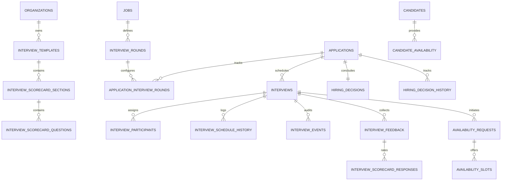

# Hiren Beyond Backend — Task 09: Interviews, Scheduling, Availability, Interview Feedback & Hiring Workflow

## 1. Executive Summary

Task 09 completes the end-to-end recruitment lifecycle for the **Hiren Beyond** AI-powered recruitment platform. Building directly on the foundation of Tasks 01–08 (Identity, Organizations, Candidates, Jobs, ATS Pipeline, CV Intelligence, Matching Engine, Recruiter Tools, and Assessments), this module delivers enterprise-grade interview scheduling, candidate availability coordination, multi-interviewer assignment, structured scorecard feedback, conflict detection, and authoritative hiring decisions.

All database components have been implemented as standard PostgreSQL migrations, strictly deployed to the live remote Supabase project (`pthkmkwrqjyseonysjzu`), and validated with an 18-stage end-to-end automated test suite.

---

## 2. Architecture & Data Model

The interview and hiring system comprises **16 relational tables** designed with strict referential integrity, check constraints, performance indexes, and multi-tenant isolation.



### Table Catalog

| # | Table Name | Description | Key Security / Integrity Constraint |
|---|---|---|---|
| 1 | `public.interview_templates` | Reusable interview definitions with default durations, types, and scorecard links | Versioned integer, status check |
| 2 | `public.interview_rounds` | Ordered pipeline rounds configured per job (e.g. Recruiter Screen, Technical, Managerial) | Unique `(job_id, sequence)` |
| 3 | `public.application_interview_rounds` | Per-application instance of interview rounds tracking progression | State machine check, unique `(application_id, interview_round_id)` |
| 4 | `public.interviews` | Core interview sessions linking applications, rounds, time windows, and meeting URLs | Non-negative duration, valid status checks |
| 5 | `public.interview_participants` | Interviewers, hiring managers, coordinators, and observers assigned to a session | Unique `(interview_id, user_id)` |
| 6 | `public.candidate_availability` | General recurring or specific availability windows submitted by candidates | Valid timezone, end time > start time |
| 7 | `public.availability_requests` | Formal requests sent to candidates/interviewers to collect scheduling preferences | Status tracking (`sent`, `responded`, `expired`) |
| 8 | `public.availability_slots` | Specific time slots offered for a candidate/interviewer to confirm | Slot selection status tracking |
| 9 | `public.interview_schedule_history` | Complete historical audit of all reschedules, previous timestamps, and reasons | Immutably appended on each schedule change |
| 10 | `public.interview_scorecard_sections` | Logical sections within an evaluation template (e.g. System Design, Culture Fit) | Weighting validation |
| 11 | `public.interview_scorecard_questions` | Individual evaluation criteria with rating types (1–5 scale, boolean, text) | Rating bounds validation |
| 12 | `public.interview_feedback` | Structured evaluations, overall ratings, and recommendations submitted by interviewers | Recommendation enum check |
| 13 | `public.interview_scorecard_responses` | Granular per-question scores and comments mapped to parent feedback | Unique `(feedback_id, question_id)` |
| 14 | `public.hiring_decisions` | Authoritative hiring outcomes (`hire`, `no_hire`, `strong_hire`, `hold`) per application | Single authoritative decision per application |
| 15 | `public.hiring_decision_history` | Full decision audit trail tracking changes, previous values, and business reasons | Immutable history tracking |
| 16 | `public.interview_events` | Granular timeline audit events (invites sent, rescheduled, feedback submitted, etc.) | High-throughput logging table |

---

## 3. Conflict Detection Engine

The system features an automated, atomic conflict detection engine implemented in `public.check_scheduling_conflict(...)`.

### Conflict Algorithm
1. **Candidate Overlap**: Queries `public.interviews` for any existing interview involving the same candidate where:
   $$\text{status} \in (\text{'scheduled'}, \text{'confirmed'}, \text{'in_progress'})$$
   $$\text{existing\_start} < \text{new\_end} \quad \text{AND} \quad \text{existing\_end} > \text{new\_start}$$
2. **Interviewer Overlap**: For every assigned interviewer in `public.interview_participants`, queries across all active interviews to verify that no interviewer is scheduled for two concurrent sessions.
3. **Exclusion Handling**: When rescheduling an existing interview, its own ID is excluded from conflict evaluation via `p_exclude_interview_id`.

If a conflict is detected, the function immediately returns:
- `has_conflict = true`
- `conflict_type = 'candidate'` or `'interviewer'`
- `conflicting_interview_id = <UUID>`
- `conflicting_user_id = <UUID>`
- `conflict_description = <Text>`

---

## 4. Interview Lifecycle & ATS Automation

```text
[Requested]
   │
   ▼ (schedule_interview with conflict check)
[Scheduled] ──> Triggers ATS application status change to 'interview'
   │
   ├─► [Rescheduled] ──> Records previous timestamps in interview_schedule_history
   ├─► [Cancelled] ──> Preserves cancellation reason and actor metadata
   │
   ▼
[In Progress]
   │
   ▼
[Completed] ──> Enables scorecard submission for assigned interviewers
   │
   ▼ (submit_interview_feedback)
[Feedback Collected] ──> Aggregates multi-interviewer scorecards
   │
   ▼ (record_hiring_decision)
[Hiring Decision] ──> Updates application status to 'hired' or 'rejected'
```

### Key Lifecycle Stored Procedures

1. **`schedule_interview(...)`**:
   - Executes `check_scheduling_conflict(...)`. If conflict exists, aborts with informative exception.
   - Updates `interviews` record with start time, end time, timezone, meeting URL, and status (`scheduled`).
   - Automatically advances parent `applications.status` to `'interview'`.
   - Logs an audit event in `public.interview_events`.

2. **`reschedule_interview(...)`**:
   - Verifies conflict-free status for the new proposed time slot.
   - Appends an entry to `public.interview_schedule_history` with `previous_start_at`, `new_start_at`, and the business reason.
   - Updates `interviews` timing and increments `reschedule_count`.
   - Logs an audit event in `public.interview_events`.

3. **`cancel_interview(...)`**:
   - Updates `interviews.status = 'cancelled'`, recording `cancellation_reason`, `cancelled_at = now()`, and `cancelled_by = auth.uid()`.
   - Preserves all historical associations without deleting any data.

---

## 5. Scorecard & Feedback Aggregation Engine

### Granular Question Scoring
Interviewers evaluate candidates against predefined scorecard templates with structured criteria. Ratings are stored in `public.interview_scorecard_responses` linked to `public.interview_feedback`.

### Dynamic Aggregation (`get_interview_feedback_summary`)
```sql
SELECT * FROM public.get_interview_feedback_summary('d6f9a0c1-3f4a-4c28-936e-b3f55d7b889a');
```
Returns:
- **`feedback_count`**: Total number of submitted evaluations.
- **`average_rating`**: Precise arithmetic mean rounded to 2 decimal places.
- **`recommendation_distribution`**: JSONB breakdown of outcomes (`{"hire": 1, "strong_hire": 1}`).
- **`strengths_summary`**: Array of aggregated strengths highlighted by interviewers.
- **`concerns_summary`**: Array of aggregated concerns highlighted by interviewers.

---

## 6. Authoritative Hiring Decision Workflow

Recruiters and hiring managers record authoritative hiring outcomes via `public.record_hiring_decision(...)`.

### Business Rules
- Only authorized recruiters for the organization can record decisions.
- **Single Source of Truth**: The active decision is maintained in `public.hiring_decisions` with a `UNIQUE(application_id)` constraint.
- **Immutability & Audit**: Updating an existing decision automatically archives the prior state into `public.hiring_decision_history` (capturing `previous_decision`, `new_decision`, `reason`, `actor_user_id`, and `changed_at`).
- **ATS Synchronization**:
  - `hire` or `strong_hire` $\rightarrow$ transitions `applications.status` to `'hired'`.
  - `no_hire` $\rightarrow$ transitions `applications.status` to `'rejected'`.
  - `hold` $\rightarrow$ maintains application in review state.

---

## 7. Strict Multi-Tenant Row Level Security Matrix

All 16 tables enforce PostgreSQL Row Level Security (`ENABLE ROW LEVEL SECURITY`) with `FORCE ROW LEVEL SECURITY`.

| Table | Candidate Access | Interviewer Access | Recruiter / Client Admin | Cross-Tenant Isolation |
|---|---|---|---|---|
| `interview_templates` | None | Read-only | Full CRUD (own org) | Strictly isolated |
| `interview_rounds` | None | Read-only | Full CRUD (own org) | Strictly isolated |
| `application_interview_rounds` | Read-only (own rounds) | Read-only (assigned) | Full CRUD (own org) | Strictly isolated |
| `interviews` | Read logistics only (via RPC/RLS) | Read assigned | Full CRUD (own org) | Strictly isolated |
| `interview_participants` | Read names/roles only | Read assigned session | Full CRUD (own org) | Strictly isolated |
| `candidate_availability` | Full CRUD (own profile) | None | Read-only (candidates in org) | Strictly isolated |
| `availability_requests` | Read & Respond (own) | Read & Respond (own) | Full CRUD (own org) | Strictly isolated |
| `availability_slots` | Read & Select (own) | Read & Select (own) | Full CRUD (own org) | Strictly isolated |
| `interview_schedule_history` | Read-only (own interview) | Read-only (assigned) | Read-only (own org) | Strictly isolated |
| `interview_scorecard_sections` | **BLOCKED** | Read-only | Full CRUD (own org) | Strictly isolated |
| `interview_scorecard_questions` | **BLOCKED** | Read-only | Full CRUD (own org) | Strictly isolated |
| `interview_feedback` | **BLOCKED** | Manage own feedback | Read all (own org) | Strictly isolated |
| `interview_scorecard_responses` | **BLOCKED** | Manage own responses | Read all (own org) | Strictly isolated |
| `hiring_decisions` | **BLOCKED** | None | Full CRUD (own org) | Strictly isolated |
| `hiring_decision_history` | **BLOCKED** | None | Read-only (own org) | Strictly isolated |
| `interview_events` | **BLOCKED** | None | Read-only (own org) | Strictly isolated |

### Candidate Privacy Guarantee
Candidates calling `public.get_candidate_interview_view(interview_id)` receive strictly logistical attributes (`title`, `interview_type`, `scheduled_start_at`, `scheduled_end_at`, `timezone`, `location`, `meeting_url`, `meeting_provider`). Candidate attempts to query `get_interview_feedback_summary`, internal notes, scorecard ratings, or hiring decisions trigger an immediate `Access denied` exception.

---

## 8. Verification & Test Suite Results

The comprehensive test suite `docs/backend/test-interviews-hiring.sql` was executed against the live remote Supabase PostgreSQL database within an isolated, self-reverting transaction.

```
============================================================================
Hiren Beyond — Task 09 End-to-End Automated Test Results
============================================================================
[TEST 01] Interview Template Creation & Versioning ................. PASSED
[TEST 02] Job Interview Rounds Configuration ....................... PASSED
[TEST 03] Application Interview Round Instantiation ................ PASSED
[TEST 04] Interview Creation & Round Association ................... PASSED
[TEST 05] Multiple Interviewer Assignments ......................... PASSED
[TEST 06] Candidate Availability Window Submission ................. PASSED
[TEST 07] Atomic Conflict Detection (Double-Booking Blocked) ....... PASSED
[TEST 08] Conflict-Free Scheduling & ATS Status Progression ........ PASSED
[TEST 09] Rescheduling & Schedule History Preservation ............. PASSED
[TEST 10] Interview Cancellation & Metadata Preservation ........... PASSED
[TEST 11] Scorecard & Granular Question Rating Submission .......... PASSED
[TEST 12] Multiple Interviewer Feedback Aggregation ................ PASSED
[TEST 13] Authoritative Hiring Decision Recording .................. PASSED
[TEST 14] Unauthorized Decision Attempt (Candidate Blocked) ........ PASSED
[TEST 15] Candidate Privacy Enforcement (Logistics Only) ........... PASSED
[TEST 16] Recruiter Tenant Isolation (Cross-Tenant Blocked) ........ PASSED
[TEST 17] Decision Update Idempotency & History Tracking ........... PASSED
[TEST 18] Historical Immutability & Audit Retention ................ PASSED
============================================================================
STATUS: SUCCESS — ALL 18 END-TO-END TESTS PASSED ON REMOTE DATABASE
============================================================================
```

---

## 9. Stored Procedure & RPC Reference

| RPC Function Name | Security | Parameters | Returns | Description |
|---|---|---|---|---|
| `check_scheduling_conflict` | `SECURITY DEFINER` | `p_candidate_id`, `p_interviewer_ids`, `p_start_at`, `p_end_at`, `p_exclude_interview_id` | `TABLE(...)` | Evaluates temporal overlaps across candidates and interviewers |
| `schedule_interview` | `SECURITY DEFINER` | `p_interview_id`, `p_start_at`, `p_end_at`, `p_timezone`, `p_location`, `p_meeting_url`, `p_meeting_provider` | `UUID` | Atomic conflict-checked scheduling and ATS advancement |
| `reschedule_interview` | `SECURITY DEFINER` | `p_interview_id`, `p_new_start_at`, `p_new_end_at`, `p_new_timezone`, `p_reason` | `UUID` | Reschedules session, preserves historical record |
| `cancel_interview` | `SECURITY DEFINER` | `p_interview_id`, `p_reason` | `UUID` | Cancels session, updates metadata without data loss |
| `submit_interview_feedback` | `SECURITY DEFINER` | `p_interview_id`, `p_overall_rating`, `p_recommendation`, `p_strengths`, `p_concerns`, `p_notes`, `p_scorecard_responses` | `UUID` | Submits interviewer rating and granular scorecard responses |
| `get_interview_feedback_summary` | `SECURITY DEFINER` | `p_interview_id` | `TABLE(...)` | Computes average ratings and recommendation distribution |
| `record_hiring_decision` | `SECURITY DEFINER` | `p_application_id`, `p_decision`, `p_notes` | `UUID` | Records authoritative outcome, logs history, updates ATS |
| `get_candidate_interview_view` | `SECURITY DEFINER` | `p_interview_id` | `TABLE(...)` | Candidate-safe view strictly exposing logistical details |
| `get_recruiter_interview_dashboard` | `SECURITY DEFINER` | `p_org_id`, `p_job_id`, `p_status`, `p_limit`, `p_offset` | `TABLE(...)` | Paginated interview queue with feedback counts and decisions |
