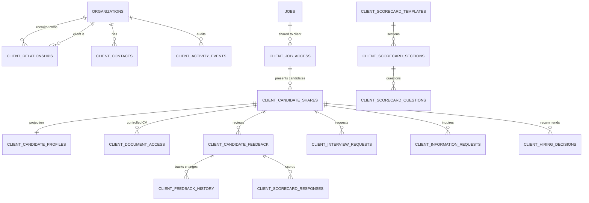

# Hiren Beyond Backend — Task 10: Client Portal, Client Feedback, Candidate Presentation & Client Hiring Collaboration

## 1. Executive Summary

Task 10 delivers the complete **Client Portal & Hiring Collaboration** backend module for the **Hiren Beyond** AI-powered recruitment platform. This module bridges recruitment teams and corporate hiring clients by enabling secure, scoped job sharing, client-safe candidate presentation profiles, multi-stakeholder scorecard evaluations, interview requests, structured information inquiries, and client hiring recommendations.

Importantly, this module enforces strict separation between internal recruiter operations and external client portal views:
* Clients access only jobs and candidates explicitly shared with their client organization.
* Internal recruiter notes, unredacted candidate contact details, raw assessment details, internal interview feedback, and internal hiring decisions are completely invisible to clients.
* Client hiring inputs remain advisory recommendations (`recommend_hire`, `recommend_reject`, `request_final_interview`, `hold`), preserving the recruiter's authoritative ownership over the ATS pipeline.

All database components are implemented as native PostgreSQL migrations, deployed and verified on the live remote Supabase project (`pthkmkwrqjyseonysjzu`), and tested via a 20-scenario end-to-end automated test suite.

---

## 2. Architecture & Data Model (16 Tables)



### Table Catalog

| # | Table Name | Purpose & Structure | Security / Integrity Constraint |
|---|---|---|---|
| 1 | `public.client_relationships` | B2B relationship between recruitment org and client org | `status IN ('prospect', 'active', 'paused', 'closed')`, `UNIQUE(recruiter, client)` |
| 2 | `public.client_contacts` | Contact points, hiring leads, and primary contacts for client | FK to `organizations` and `profiles`, `is_primary` flag |
| 3 | `public.client_job_access` | Explicit grant of job requisition to client organization | `status IN ('pending', 'active', 'paused', 'closed', 'revoked')`, `visibility`, `expires_at` |
| 4 | `public.client_candidate_shares` | Explicit candidate presentation instance for a shared job | `status IN ('shared', 'hidden', 'revoked', 'expired')`, `visibility_config JSONB` |
| 5 | `public.client_candidate_profiles` | Client-safe candidate projection (redacted per visibility rules) | `UNIQUE(candidate_share_id)`, derived from verified candidate entities |
| 6 | `public.client_document_access` | Short-lived, controlled CV/attachment access for client | `access_type IN ('view', 'download')`, `expires_at`, `revoked_at` |
| 7 | `public.client_candidate_feedback` | Client reviewer evaluation, rating, comments, and decision | `decision IN ('interested', 'maybe', 'not_interested', 'request_interview', 'request_more_information')` |
| 8 | `public.client_feedback_history` | Complete decision transition audit trail | Immutable append on decision updates |
| 9 | `public.client_scorecard_templates` | Client evaluation templates (rubrics) | `UNIQUE(client_org_id, name, version)`, versioned integer |
| 10 | `public.client_scorecard_sections` | Sections within a client rubric (e.g. Technical, Leadership) | `weight >= 0`, sequential order |
| 11 | `public.client_scorecard_questions` | Individual evaluation questions | `response_type IN ('rating', 'yes_no', 'text', 'choice')` |
| 12 | `public.client_scorecard_responses` | Granular question scores submitted with feedback | `UNIQUE(feedback_id, question_id)`, rating bounds (1–5) |
| 13 | `public.client_interview_requests` | Formal client request for candidate interview | `status IN ('pending', 'accepted', 'declined', 'scheduled', 'cancelled')` |
| 14 | `public.client_information_requests` | Structured client inquiries regarding candidate | `status IN ('pending', 'answered', 'declined')`, response tracking |
| 15 | `public.client_hiring_decisions` | Client hiring recommendation to recruiter | `decision IN ('recommend_hire', 'recommend_reject', 'request_final_interview', 'hold')` |
| 16 | `public.client_activity_events` | Granular client portal activity timeline | High-throughput audit stream |

---

## 3. Candidate Presentation & Privacy Layer

To preserve candidate confidentiality and prevent data leakage, clients never receive raw queries against internal candidate tables.

### Presentation Projection Engine (`public.client_candidate_profiles`)
When a recruiter invokes `share_candidate_with_client(...)`:
1. The engine checks active job sharing status between the recruiter organization and the client organization.
2. It compiles a client-safe snapshot projection into `public.client_candidate_profiles` governed by `visibility_config`:
   * `show_name`: If `false`, anonymizes candidate name to `Candidate <UUID_PREFIX>`.
   * `show_email` & `show_phone`: Withholds personal contact details by default.
   * `show_salary`: Suppresses compensation expectations unless explicitly shared.
   * `show_experience` & `show_education`: Projects verified milestones while excluding private notes.
   * `show_match_score` & `show_match_explanation`: Displays high-level alignment score without exposing proprietary algorithmic weights.
   * `show_cv`: Suppresses direct CV access unless explicitly granted via `public.client_document_access`.

---

## 4. Client Collaboration & Hiring Workflow

```text
[Recruiter shares Job]
       │
       ▼
[Recruiter shares Candidate] ──► Generates client_candidate_profiles projection
       │
       ▼
[Client Reviews Candidate]
       │
       ├─► Submit Feedback / Scorecards (submit_client_feedback)
       │       └─► Logs transition in client_feedback_history
       │
       ├─► Request More Information (request_more_candidate_information)
       │       └─► Recruiter receives inquiry and answers
       │
       ├─► Request Interview (request_client_interview)
       │       └─► Recruiter schedules session via Task 09 engine
       │
       └─► Submit Hiring Recommendation (submit_client_hiring_decision)
               └─► Advisory input: Recruiter confirms final ATS hiring decision
```

### Key Workflow Rules
* **Client Advisory Hiring**: Calling `submit_client_hiring_decision` stores a client-level recommendation (`recommend_hire`, `recommend_reject`, etc.). It **never** alters the internal `applications.status` directly. The internal recruiter retains authoritative control via `record_hiring_decision(...)`.
* **Idempotent Reviews**: Retrying or updating feedback updates the existing review row while recording prior choices in `public.client_feedback_history`.
* **Controlled Document Access**: CVs are shared via `public.client_document_access` with mandatory expiration (`expires_at`) and instantaneous revocation capabilities (`revoked_at`).

---

## 5. Stored Procedures & Functions Reference (14 RPCs)

| RPC Function Name | Security | Parameters | Returns | Description |
|---|---|---|---|---|
| `check_user_is_client_member` | `SECURITY DEFINER` | `p_client_org_id` | `BOOLEAN` | Verifies user membership in client organization |
| `check_user_is_client_admin` | `SECURITY DEFINER` | `p_client_org_id` | `BOOLEAN` | Verifies user has client admin role |
| `share_job_with_client` | `SECURITY DEFINER` | `p_job_id`, `p_client_org_id`, `p_visibility`, `p_expires_at`, `p_config` | `UUID` | Shares job opening with client organization |
| `revoke_client_job_access` | `SECURITY DEFINER` | `p_job_id`, `p_client_org_id`, `p_reason` | `VOID` | Revokes job access and cascadingly revokes child shares |
| `share_candidate_with_client` | `SECURITY DEFINER` | `p_application_id`, `p_client_org_id`, `p_visibility_config`, `p_expires_at` | `UUID` | Compiles safe presentation projection and shares candidate |
| `revoke_client_candidate_share` | `SECURITY DEFINER` | `p_share_id`, `p_reason` | `VOID` | Immediately revokes candidate visibility in portal |
| `get_client_jobs` | `SECURITY DEFINER` | `p_client_org_id` | `TABLE(...)` | Lists active, non-expired shared jobs with candidate counts |
| `get_client_job_candidates` | `SECURITY DEFINER` | `p_client_org_id`, `p_job_id`, `p_filter_status`, `p_sort_by`, `p_limit`, `p_offset` | `TABLE(...)` | Paginated, filtered list of presented candidates |
| `get_client_candidate` | `SECURITY DEFINER` | `p_share_id` | `TABLE(...)` | Fetches complete client-safe profile projection |
| `submit_client_feedback` | `SECURITY DEFINER` | `p_share_id`, `p_decision`, `p_rating`, `p_comments`, `p_feedback_type`, `p_scorecard_responses` | `UUID` | Records feedback and scorecard question ratings |
| `request_client_interview` | `SECURITY DEFINER` | `p_share_id`, `p_preferred_timeframes`, `p_notes` | `UUID` | Submits formal candidate interview request |
| `request_more_candidate_information` | `SECURITY DEFINER` | `p_share_id`, `p_question`, `p_category` | `UUID` | Submits inquiry regarding candidate |
| `submit_client_hiring_decision` | `SECURITY DEFINER` | `p_share_id`, `p_decision`, `p_reason` | `UUID` | Records client hiring recommendation |
| `get_client_job_dashboard` | `SECURITY DEFINER` | `p_client_org_id`, `p_job_id` | `TABLE(...)` | Aggregate recruitment metrics for client dashboard |
| `compare_client_candidates` | `SECURITY DEFINER` | `p_client_org_id`, `p_share_ids` | `TABLE(...)` | Side-by-side comparison of presented candidates |

---

## 6. Strict Multi-Tenant Row Level Security Matrix

All 16 tables enforce PostgreSQL Row Level Security with `FORCE ROW LEVEL SECURITY`.

| Table | Candidate | Client Reviewer / Admin | Recruiter / Agency | Cross-Tenant Isolation |
|---|---|---|---|---|
| `client_relationships` | Blocked | Read own relationship | Manage own relationships | Strictly isolated |
| `client_contacts` | Blocked | Manage own contacts | Read client contacts | Strictly isolated |
| `client_job_access` | Blocked | Read active shared jobs | Manage job access | Strictly isolated |
| `client_candidate_shares` | Blocked | Read active shared candidates | Manage candidate shares | Strictly isolated |
| `client_candidate_profiles` | Blocked | Read active projections | Read projections | Strictly isolated |
| `client_document_access` | Blocked | Read valid active access | Manage document access | Strictly isolated |
| `client_candidate_feedback` | **BLOCKED** | Manage own feedback | Read client feedback | Strictly isolated |
| `client_feedback_history` | **BLOCKED** | Read own feedback history | Read feedback history | Strictly isolated |
| `client_scorecard_templates` | Blocked | Manage own templates | Read client scorecards | Strictly isolated |
| `client_scorecard_sections` | Blocked | Read own sections | Read client sections | Strictly isolated |
| `client_scorecard_questions` | Blocked | Read own questions | Read client questions | Strictly isolated |
| `client_scorecard_responses` | **BLOCKED** | Manage own responses | Read responses | Strictly isolated |
| `client_interview_requests` | **BLOCKED** | Create and read own | Manage requests | Strictly isolated |
| `client_information_requests` | **BLOCKED** | Create and read own | Manage inquiries | Strictly isolated |
| `client_hiring_decisions` | **BLOCKED** | Submit recommendations | Read recommendations | Strictly isolated |
| `client_activity_events` | **BLOCKED** | Read own portal events | Read client events | Strictly isolated |

---

## 7. Automated Test Suite Results (20/20 Passed)

The test suite [`docs/backend/test-client-portal.sql`](file:///e:/New%20Downloads/Backend%20Project/docs/backend/test-client-portal.sql) was executed against the live remote Supabase PostgreSQL database inside a safe, self-reverting transaction.

```
============================================================================
Hiren Beyond — Task 10 End-to-End Automated Test Results
============================================================================
[TEST 01] Client Relationship Creation ............................. PASSED
[TEST 02] Client User & Contact Association ........................ PASSED
[TEST 03] Job Sharing With Client Organization ..................... PASSED
[TEST 04] Unshared Job Access Blocked (Client X vs Job B) .......... PASSED
[TEST 05] Candidate Sharing & Presentation Projection .............. PASSED
[TEST 06] Unshared Candidate Access Blocked ........................ PASSED
[TEST 07] Cross-Client Isolation (Client Y Blocked from Client X) .. PASSED
[TEST 08] Candidate Privacy Boundary (Internal Notes Withheld) ..... PASSED
[TEST 09] Visibility Configuration Enforcement (CV Access Omitted) . PASSED
[TEST 10] Client Feedback Submission ............................... PASSED
[TEST 11] Idempotency & Feedback History Tracking .................. PASSED
[TEST 12] Client Structured Scorecard & Question Ratings ........... PASSED
[TEST 13] Client Interview Request ................................. PASSED
[TEST 14] Client Request for More Information ...................... PASSED
[TEST 15] Client Hiring Recommendation (Non-Authoritative Input) ... PASSED
[TEST 16] Job Access Revocation & Cascading Revocation ............. PASSED
[TEST 17] Expiration Enforcement (Expired Share Blocked) ........... PASSED
[TEST 18] Closed Job Protection (Closed Job Suppresses Sharing) .... PASSED
[TEST 19] Controlled Document Access (Short-Lived CV Access) ....... PASSED
[TEST 20] Candidate Isolation (Candidate Blocked From Feedback) .... PASSED
============================================================================
STATUS: SUCCESS — ALL 20 END-TO-END TESTS PASSED ON REMOTE DATABASE
============================================================================
```

---

## 8. Migration File & Deployment Status

* **Migration File**: [`supabase/migrations/20260915001100_client_portal_collaboration.sql`](file:///e:/New%20Downloads/Backend%20Project/supabase/migrations/20260915001100_client_portal_collaboration.sql) (69,900 bytes)
* **Deployment Command**: `npx supabase db push --linked`
* **Sync Confirmation**:
  ```json
  {"migrations":[{"local":"20260915001100","remote":"20260915001100","time":"2026-09-15 00:11:00"}],"message":"Migrations listed"}
  ```
