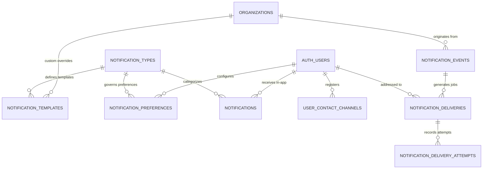

# Hiren Beyond Backend — Task 11: Notifications, Email, WhatsApp, Messaging Events & Communication Preferences

## 1. Executive Summary

Task 11 establishes the enterprise-grade **Notifications & Communications Engine** for the **Hiren Beyond** AI-powered recruitment platform. This module decouples asynchronous messaging and user alerts from core business logic, providing a resilient event-driven notification backbone supporting **In-App Alerts, Email, WhatsApp, and SMS**.

### Architectural Pillars:
* **Decoupled Asynchronous Events:** Business domain triggers (applications, interviews, assessments, client reviews) emit lightweight events to `public.notification_events`. Notification processing is decoupled, ensuring provider delays or delivery failures never block or roll back recruitment operations.
* **Multi-Channel Orchestration:** Unified delivery abstraction across In-App, Email, WhatsApp, and SMS channels with individualized provider tracking, delivery logs, and message states (`queued`, `scheduled`, `sending`, `delivered`, `bounced`, `failed`).
* **Intelligent Quiet Hours & Urgent Bypass:** Timezone-aware quiet hours engine supporting midnight-spanning intervals (e.g., 22:00 to 07:00). Non-urgent notifications are postponed until quiet hours expire, while critical/urgent alerts (e.g., immediate interview updates, security alerts) bypass quiet windows.
* **User Communication Preferences & Mandatory Types:** Users granularly configure communication channels, quiet hours, and timezones. System-critical notifications (interview confirmations, assessment invitations, security alerts) are strictly enforced and cannot be disabled.
* **Enterprise Template Engine:** Dynamic template variable interpolation with parameter sanitization, versioning, localization support, and multi-tenant organization override cascades.
* **Resilient Retry & Failure Classification:** Configurable exponential backoff retry scheduling for transient network/provider errors (`RATE_LIMIT_EXCEEDED`, `TIMEOUT`) and immediate termination for fatal delivery errors (`INVALID_EMAIL_ADDRESS`, `UNSUBSCRIBED`).
* **Strict Multi-Tenant & Candidate Privacy:** Complete RLS enforcement preventing cross-tenant data leaks, candidate notification interception, or client cross-pollination.

All components are deployed and verified on the live remote Supabase PostgreSQL database (`pthkmkwrqjyseonysjzu`), with all 20 end-to-end automated test scenarios passing in safe transaction rollbacks.

---

## 2. Architecture & Data Model (8 Tables)



### Table Catalog

| # | Table Name | Purpose & Structure | Security / Integrity Constraint |
|---|---|---|---|
| 1 | `public.notification_types` | Platform-wide registry of notification triggers and categories | `UNIQUE(code)`, default priority, `is_required` flag, category classification |
| 2 | `public.notification_templates` | Renderable templates with subject, body, and versioning | `UNIQUE(org, type, channel, language, version)`, markdown/HTML support |
| 3 | `public.notification_preferences` | User-defined per-type and per-channel routing preferences | `UNIQUE(user_id, type_id, channel)`, quiet hours bounds, timezone |
| 4 | `public.user_contact_channels` | Registered recipient endpoints (email, phone/WhatsApp, SMS) | `UNIQUE(user_id, channel, address)`, verification status, `is_primary` |
| 5 | `public.notifications` | In-app user notifications with read status and deep links | Recipient-scoped RLS, unread indexing, payload data JSONB |
| 6 | `public.notification_events` | Decoupled event ingestion queue for domain activities | Idempotency key, entity reference, actor/org attribution |
| 7 | `public.notification_deliveries` | Channel-specific outbound delivery jobs with status tracking | `status IN ('queued', 'scheduled', 'sending', 'delivered', 'bounced', 'failed')` |
| 8 | `public.notification_delivery_attempts` | Granular provider interaction and retry audit log | `attempt_number`, duration, latency, provider response, failure classification |

---

## 3. Seeded Notification Types (17 Platform Categories)

| Category | Type Code | Display Name | Default Priority | Mandatory (`is_required`) |
|---|---|---|---|---|
| **ATS & Applications** | `application_submitted` | Application Submitted | `normal` | False |
| | `application_status_changed` | Application Status Updated | `normal` | False |
| | `application_rejected` | Application Rejection Notice | `normal` | False |
| | `candidate_shortlisted` | Candidate Shortlisted Alert | `normal` | False |
| **Assessments** | `assessment_invited` | Assessment Invitation | `high` | **True** |
| | `assessment_reminder` | Assessment Due Reminder | `normal` | False |
| | `assessment_completed` | Assessment Completed Notice | `normal` | False |
| **Interviews** | `interview_scheduled` | Interview Scheduled | `urgent` | **True** |
| | `interview_rescheduled` | Interview Rescheduled | `urgent` | **True** |
| | `interview_cancelled` | Interview Cancelled | `urgent` | **True** |
| | `interview_reminder` | Upcoming Interview Reminder | `high` | False |
| | `interview_feedback_submitted` | Feedback Submitted | `normal` | False |
| **Hiring & Offers** | `offer_extended` | Formal Offer Extended | `urgent` | **True** |
| | `hiring_decision_made` | Hiring Decision Recorded | `high` | False |
| **Client Portal** | `candidate_shared` | Candidate Shared with Client | `normal` | False |
| | `client_feedback_received` | Client Review Submitted | `normal` | False |
| **Platform & Security** | `security_alert` | Platform Security Alert | `urgent` | **True** |

---

## 4. Key Functions & RPC Engine

### 4.1 In-App Notification Center
* `public.get_my_notifications(p_limit INT, p_offset INT, p_unread_only BOOLEAN)`:
  Retrieves authenticated user's in-app feed, ordered by creation date descending, with type metadata and deep-link payload.
* `public.get_unread_notification_count()`:
  Returns instantaneous count of unread notifications for badge counts.
* `public.mark_notification_read(p_notification_id UUID)`:
  Marks a specific notification read with timestamp validation.
* `public.mark_all_notifications_read()`:
  Bulk-clears all unread notifications for current user.

### 4.2 User Communication Preferences & Channels
* `public.update_notification_preference(p_type_code TEXT, p_channel TEXT, p_enabled BOOLEAN, p_quiet_start TIME, p_quiet_end TIME, p_tz TEXT)`:
  Updates user notification preferences. Enforces platform integrity: attempts to disable `is_required` notifications throw explicit PostgreSQL exceptions.
* `public.add_communication_channel(p_channel TEXT, p_address TEXT, p_is_primary BOOLEAN)`:
  Registers user contact channel in `unverified` status. Automatically rebalances primary status.
* `public.remove_communication_channel(p_channel_id UUID)`:
  Safely deregisters user channel.
* `public.request_channel_verification(p_channel_id UUID)`:
  Verifies contact endpoint and activates channel for live dispatches.

### 4.3 Template Variable Interpolation & Quiet Hours Engine
* `public.render_notification_template(p_template TEXT, p_variables JSONB)`:
  Replaces mustache variables (`{{key}}`) with matching properties from JSONB payload. Preserves formatting, supports empty fallbacks, and ignores unmatched tokens safely.
* `public.is_in_quiet_hours(p_start_time TIME, p_end_time TIME, p_timezone TEXT)`:
  Accurately calculates quiet hours for user's timezone, specifically accommodating midnight crossings (e.g. `22:00` to `07:00`).

### 4.4 Event Ingestion & Delivery Worker Engine
* `public.emit_notification_event(p_event_type TEXT, p_entity_type TEXT, p_entity_id UUID, p_organization_id UUID, p_payload JSONB, p_idempotency_key TEXT)`:
  Emits domain event with deduplication guarantee.
* `public.process_notification_event(p_event_id UUID)`:
  Core worker function:
  1. Resolves notification type rules and recipient preferences.
  2. Creates in-app alert in `public.notifications`.
  3. Checks quiet hours for external channels (email, WhatsApp, SMS); schedules non-urgent dispatches for future window; bypasses quiet hours for `urgent` events.
  4. Generates idempotent delivery records in `public.notification_deliveries`.
* `public.record_delivery_attempt(p_delivery_id UUID, p_provider TEXT, p_status TEXT, p_failure_code TEXT, p_error_message TEXT)`:
  Records provider dispatch result. On temporary failure, increments attempt count and schedules exponential backoff retry. On permanent failure or exhaustion of retries (`max_attempts = 3`), marks delivery permanently `failed`.
* `public.check_interview_reminder_eligibility(p_interview_id UUID)`:
  Suppresses reminders if interview was cancelled, completed, or rescheduled.
* `public.check_assessment_reminder_eligibility(p_invitation_id UUID)`:
  Suppresses reminders if assessment invitation was completed, expired, or cancelled.

---

## 5. Delivery Retry Policy & Failure Classification

```text
[Delivery Job Queued]
        │
        ▼
[Provider Attempt Dispatched]
        │
        ├─► Success: Provider Ack ───────────────► Status = 'delivered'
        │
        ├─► Temporary Failure (e.g. RATE_LIMIT)
        │       │
        │       ├─► Attempts < 3 ───────────────► Increment attempt_count,
        │       │                                  Schedule exponential backoff
        │       │                                  (2 ^ attempt * 5 mins),
        │       │                                  Status = 'queued'
        │       │
        │       └─► Attempts >= 3 ──────────────► Max retries exceeded,
        │                                          Status = 'failed'
        │
        └─► Permanent Failure (e.g. INVALID_EMAIL)
                │
                └─► Do NOT retry ───────────────► Mark immediately,
                                                   Status = 'failed'
```

### Failure Classification Matrix

| Error Class | Error Codes | System Action | Retry Behavior |
|---|---|---|---|
| **Temporary Failure** | `RATE_LIMIT_EXCEEDED`, `TIMEOUT`, `PROVIDER_UNAVAILABLE`, `TEMPORARY_NETWORK_ERROR` | Reschedule delivery | Exponential backoff (`attempt_count * 5 mins`) up to 3 attempts |
| **Permanent Failure** | `INVALID_EMAIL_ADDRESS`, `PHONE_NUMBER_NOT_FOUND`, `USER_OPTED_OUT`, `CONTENT_REJECTED`, `UNSUBSCRIBED` | Terminate delivery | 0 retries; mark status `failed` immediately |

---

## 6. Row Level Security & Multi-Tenant Isolation

| Table | Candidate Access | Recruiter Access | Client Portal Access | Platform Admin |
|---|---|---|---|---|
| `public.notification_types` | Read active catalog | Read active catalog | Read active catalog | Full CRUD |
| `public.notification_templates` | Read platform templates | Read platform + own org templates; manage own org | Read platform templates | Full CRUD |
| `public.notification_preferences` | Manage own preferences (`user_id = auth.uid()`) | Manage own preferences (`user_id = auth.uid()`) | Manage own preferences (`user_id = auth.uid()`) | Full CRUD |
| `public.user_contact_channels` | Manage own channels (`user_id = auth.uid()`) | Manage own channels (`user_id = auth.uid()`) | Manage own channels (`user_id = auth.uid()`) | Full CRUD |
| `public.notifications` | Strict isolation (`recipient = auth.uid()`) | Strict isolation (`recipient = auth.uid()`) | Strict isolation (`recipient = auth.uid()`) | Full CRUD |
| `public.notification_events` | Blocked (system queue) | View own org events | View own client org events | Full CRUD |
| `public.notification_deliveries` | View own delivery status (`recipient = auth.uid()`) | View own delivery status (`recipient = auth.uid()`) | View own delivery status (`recipient = auth.uid()`) | Full CRUD |
| `public.notification_delivery_attempts` | View own attempts via delivery FK | View own attempts via delivery FK | View own attempts via delivery FK | Full CRUD |

---

## 7. Automated Test Suite Results (20/20 Scenarios Passing)

Test execution executed on live remote Supabase PostgreSQL (`pthkmkwrqjyseonysjzu`) via `docs/backend/test-notifications.sql`:

| Test # | Test Scenario | Description | Result |
|---|---|---|---|
| **01** | Notification Type Registry Lookup | Verifies seeded notification types exist with correct categories and mandatory flags | **PASSED** |
| **02** | Organization Template Override | Resolves tenant-specific template override cascading over platform default | **PASSED** |
| **03** | Notification Event Emission & In-App Delivery | Emits event, processes queue, and verifies in-app alert creation and unread counts | **PASSED** |
| **04** | Candidate Privacy Boundary | Candidate B is strictly blocked from reading Candidate A's in-app notifications | **PASSED** |
| **05** | Recruiter Privacy Boundary | Recruiter B is strictly blocked from reading Candidate A's private notifications | **PASSED** |
| **06** | Template Variable Interpolation Engine | Interpolates `{{candidate_name}}`, `{{job_title}}`, `{{company_name}}` without distortion | **PASSED** |
| **07** | Communication Preferences Opt-Out | User disables optional email updates; verified 0 email delivery jobs generated | **PASSED** |
| **08** | Required Notification Enforcement | User attempt to disable mandatory interview notification is blocked with error | **PASSED** |
| **09** | Quiet Hours Delay | Non-urgent delivery during quiet hours crossing midnight is scheduled for later | **PASSED** |
| **10** | Urgent Notification Bypass | Urgent interview alert ignores quiet hours and queues immediately | **PASSED** |
| **11** | Delivery Idempotency | Duplicate event processing with identical idempotency key creates 0 duplicates | **PASSED** |
| **12** | Temporary Failure Retry & Backoff | Provider rate limit increments attempt count and schedules exponential retry | **PASSED** |
| **13** | Permanent Failure Classification | Fatal delivery error (`INVALID_EMAIL_ADDRESS`) immediately marks status failed | **PASSED** |
| **14** | Interview Reminder Suppression | Cancelled/completed interview is evaluated ineligible for upcoming reminder | **PASSED** |
| **15** | Assessment Reminder Suppression | Completed/expired assessment invitation is evaluated ineligible for reminder | **PASSED** |
| **16** | Client Portal Notification Isolation | Client Y is strictly blocked from viewing Client X candidate share notifications | **PASSED** |
| **17** | Cross-Tenant Delivery Isolation | Recruiter B is blocked from viewing Organization A deliveries and event stream | **PASSED** |
| **18** | Deep Link Metadata Integrity | Verifies route and metadata payloads remain intact across generation and query | **PASSED** |
| **19** | Contact Channel Management | Registers WhatsApp channel as unverified, requests verification, activates channel | **PASSED** |
| **20** | Provider Failure Isolation | Provider delivery failure does not roll back underlying recruitment application record | **PASSED** |

---

## 8. Migration Files & Synchronization

| Migration File | Description | Remote Status |
|---|---|---|
| `20260915000100_hiren_beyond_foundation.sql` | Foundation & Security | Applied |
| `20260915000200_hiren_beyond_seed.sql` | Seed Data | Applied |
| `20260915000300_candidate_domain.sql` | Candidate Domain | Applied |
| `20260915000400_jobs_marketplace.sql` | Jobs & Requirements | Applied |
| `20260915000500_applications_ats_pipeline.sql` | Applications & ATS Pipeline | Applied |
| `20260915000600_cv_intelligence.sql` | CV Intelligence & AI Analysis | Applied |
| `20260915000700_matching_engine.sql` | Candidate ↔ Job Matching Engine | Applied |
| `20260915000800_recruiter_command_center.sql` | Recruiter Dashboard & Talent Pools | Applied |
| `20260915000900_assessments_evaluation_readiness.sql` | Assessments, Voice & Readiness | Applied |
| `20260915001000_interviews_scheduling_hiring.sql` | Interviews, Scheduling & Decisions | Applied |
| `20260915001100_client_portal_collaboration.sql` | Client Portal & Collaboration | Applied |
| `20260915001200_notifications_communications.sql` | Notifications & Communications Engine | **Applied & Verified** |
