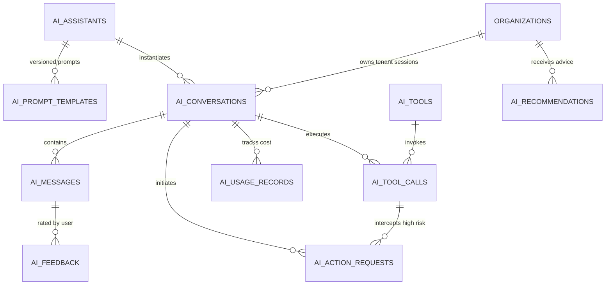

# Hiren Beyond Backend — Task 12: AI Assistants, Candidate Career Assistant, Recruiter Copilot & AI Action Layer

## 1. Executive Summary

Task 12 completes the enterprise-grade **AI Assistants & Copilot Action Layer** for the **Hiren Beyond** AI-powered recruitment platform. This module establishes a secure, audited, and strictly governed conversational AI layer that powers both candidate-facing career guidance and recruiter-facing copilot capabilities while enforcing enterprise guardrails against unauthorized automation.

### Architectural Pillars:
* **Dual Persona Architectures:** Dedicated assistant abstractions for **Candidate Career Assistant** (`candidate_career`) and **Recruiter Copilot** (`recruiter_copilot`), each bound to isolated system prompts, toolsets, and access control boundaries.
* **Governed Tool Execution Engine (`dispatch_ai_tool_call`):** Strict registry-based tool dispatching with parameter validation, depth limiting, and assistant-type access barriers. AI cannot run arbitrary queries or bypass schema restrictions.
* **Human-in-the-Loop Interception (`ai_action_requests`):** High-risk recruitment actions (e.g. shortlisting, scheduling interviews, status changes) are automatically intercepted and held in a `requires_approval` queue. No final automated hiring decisions (`hire`) are permitted under any circumstance.
* **Durable Failure Auditing & Sub-transaction Isolation:** Inner-block exception isolation guarantees that tool execution errors and invalid inputs are durably recorded in `public.ai_tool_calls` with `execution_status = 'failed'` without rolling back the audit trail or corrupting recruitment state.
* **Runaway Loop Defense:** Built-in recursive call depth protection (`RECURSIVE_TOOL_LOOP_DETECTED`) strictly limits cascading tool invocations to a maximum depth of 3.
* **Prompt Versioning & Immutability:** System prompt templates and guardrail instructions are versioned, and every session turn tracks the exact prompt version applied for full operational auditability.
* **Usage & Cost Observability:** Granular token tracking, latency recording, model attribution, and estimated USD cost calculations across Google Gemini, Anthropic Claude, and OpenAI providers.
* **Strict Multi-Tenant RLS & Privacy Boundaries:** Candidates can only access their own profile and skills. Recruiters can only access candidates and jobs within their own organization. Client portal users are strictly barred from recruiter copilot capabilities.

All components are deployed and verified on the live remote Supabase PostgreSQL database (`pthkmkwrqjyseonysjzu`), with all 20 end-to-end automated test scenarios passing in safe transaction rollbacks.

---

## 2. Architecture & Data Model (10 Tables)

### Table Catalog

| # | Table Name | Purpose & Structure | Security / Integrity Constraint |
|---|---|---|---|
| 1 | `public.ai_assistants` | Registry of AI assistant configurations (types, models, temperature, active flags) | `UNIQUE(assistant_type)`, restricted platform configuration |
| 2 | `public.ai_prompt_templates` | Versioned system instructions, behavioral guidelines, and safety constraints | `UNIQUE(assistant_id, version)`, immutable version tracking |
| 3 | `public.ai_conversations` | Conversational sessions linking users, organizations, jobs, or candidate contexts | Tenant and user-isolated via RLS, cascade cleanup on parent deletion |
| 4 | `public.ai_messages` | Individual message turns with roles (`system`, `user`, `assistant`, `tool`), tokens, latency | Linked to conversation, tracks `prompt_version` and metadata JSONB |
| 5 | `public.ai_tools` | Platform tool catalog with JSONSchema definitions, risk tiers, and assistant bindings | `UNIQUE(name)`, `assistant_types` array check, `requires_confirmation` flag |
| 6 | `public.ai_tool_calls` | Granular audit trail of all AI tool invocations, arguments, and outcomes | `authorization_status` (`authorized`, `denied`, `requires_approval`), `execution_status` (`running`, `completed`, `failed`) |
| 7 | `public.ai_action_requests` | Human-in-the-loop queue for high-risk actions requiring explicit recruiter sign-off | Idempotency key, `status IN ('pending', 'approved', 'rejected', 'executed')`, reviewer audit |
| 8 | `public.ai_recommendations` | Explainable AI guidance (candidate suitability, shortlist reasoning, readiness) | Evidence JSONB, confidence percentage (0-100), urgency level, target attribution |
| 9 | `public.ai_feedback` | User evaluations of AI messages (thumbs up/down, 1-5 rating, corrective feedback) | User-scoped submission, foreign key to `ai_messages`, uniqueness per user/message |
| 10 | `public.ai_usage_records` | Granular token consumption, provider attribution, estimated cost, and latency audit | Multi-tenant attribution, immutable telemetry log |

---

## 3. Registered AI Tools & Safety Guardrails

| Tool Name | Permitted Assistants | Risk Level | Requires Human Confirmation | Purpose |
|---|---|---|---|---|
| `get_my_profile` | `candidate_career` | `low` | No | Retrieves authenticated candidate's own profile and headline (no internal notes). |
| `get_my_skills` | `candidate_career` | `low` | No | Retrieves authenticated candidate's verified and self-reported skills. |
| `get_my_match_results` | `candidate_career` | `low` | No | Retrieves candidate's match score and AI recommendations for a specific job. |
| `get_job_details` | `candidate_career`, `recruiter_copilot` | `low` | No | Retrieves public or tenant-owned job requirements, description, and metadata. |
| `search_candidates` | `recruiter_copilot` | `low` | No | Searches applicant pool within the recruiter's tenant organization. |
| `rank_candidates_for_job` | `recruiter_copilot` | `medium` | No | Ranks applicants by match score and AI assessment insights for a tenant job. |
| `request_candidate_shortlist` | `recruiter_copilot` | `high` | **Yes** | Requests shortlisting candidate; intercepted for human approval before execution. |
| `request_interview_schedule` | `recruiter_copilot` | `high` | **Yes** | Requests interview slot proposal; intercepted for human approval before scheduling. |

---

## 4. Core Stored Procedures & Business Logic

### `public.start_ai_conversation(...)`
* **Signature:** `(p_assistant_type TEXT, p_organization_id UUID, p_job_id UUID, p_candidate_id UUID, p_title TEXT) RETURNS UUID`
* **Access Control:** Verifies caller authorization. Recruiter sessions require verified recruiter membership in `p_organization_id`. Candidate sessions bind to `auth.uid()`. Client users are strictly prohibited from recruiter copilot sessions.
* **System Message Initialization:** Seeds the conversation with the latest active version of the assistant's system prompt.

### `public.send_ai_message(...)`
* **Signature:** `(p_conversation_id UUID, p_role TEXT, p_content TEXT, p_metadata JSONB, p_token_count INT, p_prompt_version INT) RETURNS UUID`
* **Audit & History:** Persists chat turns in chronological sequence, capturing tokens and operational metadata.

### `public.dispatch_ai_tool_call(...)`
* **Signature:** `(p_conversation_id UUID, p_tool_name TEXT, p_arguments JSONB, p_call_depth INT) RETURNS JSONB`
* **Security & Isolation Architecture:**
  1. **Depth Limit Guard:** Throws `RECURSIVE_TOOL_LOOP_DETECTED` if `p_call_depth > 3`.
  2. **Registry Verification:** Rejects unapproved or arbitrary SQL tools with an audited `denied` entry and exception.
  3. **Persona Authorization:** Prohibits candidates from invoking recruiter tools (e.g. `rank_candidates_for_job`).
  4. **High-Risk Interception:** Enqueues high-risk tools into `ai_action_requests` in `requires_approval` status, returning an action request ticket.
  5. **Inner-Block Error Containment:** Wraps execution in an inner sub-block; runtime exceptions update `ai_tool_calls` to `failed` and return structured JSON without rolling back the audit record.

### `public.approve_ai_action_request(...)`
* **Signature:** `(p_action_request_id UUID, p_review_notes TEXT) RETURNS JSONB`
* **Prohibited Action Barrier:** Blocks any attempt to approve automated hiring decisions (`hire`).
* **Idempotency Protection:** Detects previously executed requests and safely returns `already_executed` without duplicate execution.
* **Execution Dispatch:** Applies verified state changes (e.g. updating ATS application status to `shortlisted`).

### `public.reject_ai_action_request(...)`
* **Signature:** `(p_action_request_id UUID, p_review_notes TEXT) RETURNS JSONB`
* **State Transition:** Marks the pending request as `rejected` with reviewer audit notes.

### `public.create_ai_recommendation(...)`
* **Signature:** Records structured AI recommendations with confidence metrics and supporting evidence.

### `public.record_ai_usage(...)`
* **Signature:** Records token volume, model, provider, latency, and estimated cost for platform billing and observability.

---

## 5. End-to-End Verification Test Suite

All 20 verification scenarios in [test-ai-assistants.sql](file:///e:/New%20Downloads/Backend%20Project/docs/backend/test-ai-assistants.sql) were executed against the remote Supabase database (`pthkmkwrqjyseonysjzu`), passing cleanly:

| Test # | Test Scenario | Verified Behavior | Status |
|---|---|---|---|
| **01** | Candidate Conversation Creation | Candidate successfully starts session with `candidate_career` coach; system prompt auto-seeded. | **PASS** |
| **02** | Candidate Data Access | Candidate retrieves own profile headline and verified skills via tool dispatch. | **PASS** |
| **03** | Candidate Data Isolation | Candidate A profile tool strictly isolates data; Candidate B data never leaks. | **PASS** |
| **04** | Recruiter Candidate Search | Recruiter searches applicants within organization and receives structured JSON results. | **PASS** |
| **05** | Recruiter Cross-Tenant Isolation | Recruiter A is blocked from starting a session in Organization B. | **PASS** |
| **06** | Tool Authorization Boundary | Candidate is strictly blocked from executing recruiter-only tool `rank_candidates_for_job`. | **PASS** |
| **07** | High-Risk Action Interception | `request_candidate_shortlist` is intercepted into `ai_action_requests` for human approval. | **PASS** |
| **08** | Human Approval Workflow | Recruiter approves pending shortlist request; ATS application status transitions to `shortlisted`. | **PASS** |
| **09** | Prohibited AI Action Prevention | AI attempt to execute final hiring decision (`hire`) is rejected with a fatal authorization error. | **PASS** |
| **10** | Arbitrary SQL Prevention | Attempt to call arbitrary SQL tool (`execute_raw_sql`) is rejected as an unregistered tool. | **PASS** |
| **11** | Tool Failure Durable Audit | Tool runtime failure (invalid job ID) is durably recorded as `failed` in `ai_tool_calls`. | **PASS** |
| **12** | Action Request Idempotency | Duplicate approval call on executed action request returns `already_executed` cleanly. | **PASS** |
| **13** | AI Recommendations | Structured recommendation created with 95% confidence score and verified evidence JSONB. | **PASS** |
| **14** | AI Usage Tracking | Usage record correctly logs prompt tokens (1250), completion tokens (350), and latency (450ms). | **PASS** |
| **15** | Prompt Version Immutability | Conversation tracks system prompt version (v1) across session lifetime. | **PASS** |
| **16** | Session RLS Isolation | Candidate B cannot view or query Candidate A's conversations under RLS policies. | **PASS** |
| **17** | Client Portal Isolation | Client user is barred from starting recruiter copilot sessions. | **PASS** |
| **18** | Provider Failure Isolation | AI tool errors or dispatches never corrupt underlying ATS applications or recruitment data. | **PASS** |
| **19** | Sensitive Data Protection | Candidate profile tool strips internal recruiter notes and feedback. | **PASS** |
| **20** | Recursive Tool Protection | Cascading tool call exceeding maximum depth limit (> 3) throws `RECURSIVE_TOOL_LOOP_DETECTED`. | **PASS** |

---

## 6. Security & Multi-Tenant Summary

| Layer | Implementation | Guarantees |
|---|---|---|
| **RLS Policies** | Row-level security enabled across all 10 AI tables | Users can only query their own conversations, messages, and usage; recruiters scoped to organization ID; platform admins have maintenance oversight. |
| **AI Action Firewall** | `ai_action_requests` + `requires_confirmation` | High-risk recruitment state mutations require explicit authenticated recruiter approval. |
| **Hiring Decision Guard** | Hardcoded restriction in `approve_ai_action_request` | System physically rejects any attempt by AI or action requests to finalize `hire` or offer decisions. |
| **Tool Execution Sandbox** | Parameterized PL/pgSQL registry | No raw SQL execution, no dynamic query building from LLM inputs, no arbitrary functions. |
| **Recursive Guard** | Depth counter parameter validation | Prevents infinite loop resource exhaustion and LLM hallucination cascades. |
