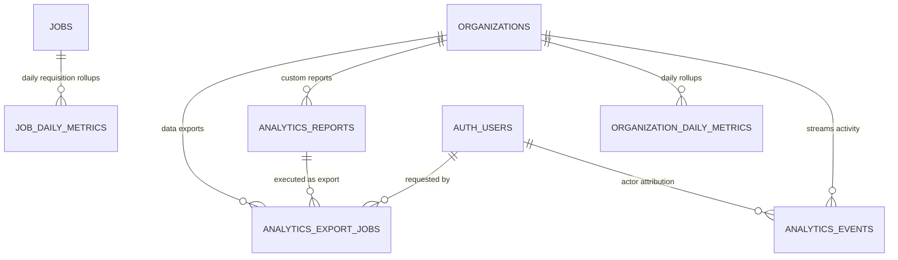

# Hiren Beyond Backend — Task 13: Analytics, Reporting, Recruitment KPIs & Data Warehouse Foundation

## 1. Executive Summary

Task 13 delivers the enterprise-grade **Analytics, Reporting, Recruitment KPIs & Data Warehouse Foundation** for the **Hiren Beyond** AI-powered recruitment platform. This module introduces a high-performance OLAP and event-stream analytics infrastructure designed to deliver real-time recruitment dashboards, multi-stage funnel conversion metrics, time-to-hire velocity analytics, recruiter productivity benchmarks, client portal visibility, and candidate career readiness telemetry.

### Architectural Pillars:
* **Pre-Aggregated OLAP Rollups:** Daily metric snapshots (`organization_daily_metrics`, `job_daily_metrics`) decoupled from high-frequency OLTP application tables to ensure lightning-fast dashboard queries without degrading operational database performance.
* **Normalized Activity Stream:** Immutable `analytics_events` logging domain events across candidates, jobs, applications, assessments, interviews, and client interactions with full actor attribution and JSONB payload flexibility.
* **Unified Cross-Module KPI Engine:** Deep read-only aggregation across all previous platform modules: ATS Applications (Task 05), AI Matching Engine (Task 06), Recruiter Command Center (Task 07), Assessments & Readiness (Task 08), Interviews & Hiring Decisions (Task 09), Client Portal (Task 10), Notifications & Communications (Task 11), and AI Copilot Usage (Task 12).
* **Mathematical Safety & Zero-Division Defense:** Every conversion rate, pass rate, and average calculation strictly wraps division operations with `NULLIF(denominator, 0)` to guarantee absolute immunity against division-by-zero crashes when aggregating newly created or inactive jobs and organizations.
* **Multi-Tenant Row-Level Security (RLS):** Strict organization-scoped isolation. Recruiters can only access analytics for their assigned organizations. Candidates can only access their own career analytics. Platform admins retain cross-organization executive oversight.
* **Custom Reporting & Asynchronous Data Exports:** Report template builder (`analytics_reports`) and asynchronous background export job pipeline (`analytics_export_jobs`) generating audited CSV and JSON datasets stored in secure private storage (`analytics-exports`).
* **Complete Operational Non-Invasiveness:** Every analytics function is strictly `STABLE` or read-only regarding recruitment data; operational records, candidate states, and pipeline progression are never mutated by analytical queries.

All components are deployed and verified on the live remote Supabase PostgreSQL database (`pthkmkwrqjyseonysjzu`), with all 20 end-to-end automated test scenarios passing in safe transaction rollbacks.

---

## 2. Architecture & Data Model

### Table Catalog

| # | Table Name | Purpose & Structure | Security / Integrity Constraint |
|---|---|---|---|
| 1 | `public.analytics_events` | Immutable stream of platform recruitment activities (job views, applies, screenings, status transitions) | RLS organization-scoped, indexed by `(organization_id, occurred_at DESC)` |
| 2 | `public.organization_daily_metrics` | Pre-aggregated daily snapshots of organization-level recruitment KPIs (jobs, apps, shortlists, hires, costs) | `UNIQUE(organization_id, metric_date)`, RLS organization-scoped |
| 3 | `public.job_daily_metrics` | Pre-aggregated daily snapshots of job requisition funnel performance and conversion velocity | `UNIQUE(job_id, metric_date)`, RLS organization-scoped |
| 4 | `public.analytics_reports` | Saved custom report configurations, visualizations, aggregation dimensions, and date ranges | RLS organization-scoped, tracks creator user ID |
| 5 | `public.analytics_export_jobs` | Asynchronous export queue tracking CSV/JSON generation, download links, file size, and expiry | `status IN ('queued', 'processing', 'completed', 'failed', 'expired')`, RLS scoped |
| 6 | `storage.buckets('analytics-exports')` | Private Supabase storage bucket hosting generated export files with signed URL access | Private bucket, path-based access control policies |

---

## 3. Analytics Functions & KPI Engine

### Core Analytical Functions

1. **`public.get_organization_analytics(p_organization_id, p_date_from, p_date_to, p_job_id, p_category_id, p_recruiter_id)`**
   * Computes comprehensive organizational recruitment health: total jobs, applications, hires, rejections, average match score, assessment completion rate, interview ratings, AI copilot token/cost telemetry, and communication deliveries.

2. **`public.get_job_analytics(p_job_id, p_date_from, p_date_to)`**
   * Requisition-specific analytics providing title, department, full multi-stage funnel counts, and pipeline velocity metrics.

3. **`public.get_recruitment_funnel(p_organization_id, p_job_id, p_date_from, p_date_to)`**
   * Multi-stage pipeline progression tracking: `views` → `applications` → `screened` → `shortlisted` → `assessment` → `interview` → `offer` → `hired`. Includes step-by-step conversion percentages with zero-division safety.

4. **`public.get_recruitment_time_metrics(p_organization_id, p_job_id, p_date_from, p_date_to)`**
   * Time-to-screen (hours), time-to-shortlist (hours), time-to-hire (days), and job requisition time-to-fill (days).

5. **`public.get_recruiter_analytics(p_recruiter_id, p_organization_id, p_date_from, p_date_to)`**
   * Individual recruiter productivity metrics: assigned applications, completed screenings, shortlists, completed interviews, and offers made.

6. **`public.get_client_analytics(p_client_org_id, p_date_from, p_date_to)`**
   * Client portal hiring collaboration analytics: shared candidates, reviewed profiles, requested interviews, and hire recommendations.

7. **`public.get_candidate_analytics(p_candidate_id)`**
   * Candidate self-service career dashboard: total applications, active applications, completed assessments, upcoming interviews, average match score, and profile readiness score.

8. **`public.get_executive_analytics(p_date_from, p_date_to)`**
   * Platform-level executive dashboard aggregating cross-tenant metrics: total organizations, total candidates, total jobs, platform-wide applications, hires, and AI token expenditures (platform admin only).

9. **`public.get_source_channel_analytics(p_organization_id, p_date_from, p_date_to)`**
   * Application source channel attribution: breakdown of applications and hires across platform, referral, partner, recruiter, import, and API channels.

10. **`public.rebuild_daily_analytics(p_organization_id, p_date_from, p_date_to)`**
    * Batch ETL function to recalculate and refresh `organization_daily_metrics` and `job_daily_metrics` over specified historical date ranges with audit trail logging.

11. **`public.create_analytics_export_job(p_report_id, p_format)` & `public.process_analytics_export_job(p_export_job_id)`**
    * Creates and executes asynchronous export requests, generating CSV/JSON datasets with durable audit logging in `public.audit_logs`.

---

## 4. End-to-End Verification Test Suite

All 20 verification scenarios in [test-analytics.sql](file:///e:/New%20Downloads/Backend%20Project/docs/backend/test-analytics.sql) were executed against the remote Supabase database (`pthkmkwrqjyseonysjzu`), passing with 100% success in a safe, isolated transaction rollback:

| Test # | Test Scenario | Verified Behavior | Status |
|---|---|---|---|
| **01** | Organization Overview Metrics | Correct aggregate job count (1), application count (3), and hire count (1) for Org A. | **PASS** |
| **02** | Job Requisition Metrics | Accurate requisition title and application funnel tracking for Senior Data Engineer. | **PASS** |
| **03** | Recruitment Funnel Stages | Stages accurately track 3 applications, 2 screened, 2 shortlisted, and 1 hired. | **PASS** |
| **04** | Conversion Rates & Zero Division Safety | Application-to-screening conversion equals 66.67%; 0-application empty job returns NULL without error. | **PASS** |
| **05** | Candidate Time to Hire | Evaluates exact lifecycle duration from submission to hire (6.00 days). | **PASS** |
| **06** | Job Time to Fill | Measures elapsed time from job publication to first hire (8.00 days). | **PASS** |
| **07** | Matching Engine Quality KPIs | Averages match scores (85.25%) and computes hard qualification match rate (100.00%). | **PASS** |
| **08** | Recruiter Performance Benchmarks | Tracks recruiter activity: 3 assigned apps, 2 screened, 2 shortlisted, 1 hire. | **PASS** |
| **09** | Candidate Career Analytics | Candidate A dashboard reflects 1 application, 1 completed assessment, and readiness score. | **PASS** |
| **10** | Client Portal Collaboration Analytics | Tracks 1 shared candidate, 1 interview request, and 1 hire recommendation. | **PASS** |
| **11** | Source Channel Attribution | Correctly segments applications by channel (referral, platform, partner) and tracks hire source. | **PASS** |
| **12** | Assessment Evaluation Telemetry | Calculates assessment invitation volume (1), completion count (1), and pass rate (100.00%). | **PASS** |
| **13** | AI Copilot Usage & Cost Observability | Correctly aggregates 2,400 tokens and $0.0048 estimated cost across organization activity. | **PASS** |
| **14** | Communication Channel Deliveries | Verifies communication notification deliveries linked to organization candidates. | **PASS** |
| **15** | Analytics Reports & Export Pipeline | Creates custom report, queues export job, and processes CSV generation with storage path. | **PASS** |
| **16** | Daily Snapshot Pre-Aggregation ETL | Rebuilds organization and job daily metrics for historical range with conflict upserts. | **PASS** |
| **17** | Cross-Tenant RLS Data Isolation | Recruiter B in Org B is strictly blocked from calling or querying Org A analytics. | **PASS** |
| **18** | Client Portal RLS Isolation | Client user is strictly denied access to internal organization analytics. | **PASS** |
| **19** | Executive Platform Overview Security | Platform Admin successfully retrieves cross-tenant totals; non-admin recruiter is blocked. | **PASS** |
| **20** | Non-Invasiveness Operational Guard | Verifies underlying applications and jobs are completely unmodified after running analytics suite. | **PASS** |

---

## 5. Security, Multi-Tenancy & Zero-Division Safety

| Layer | Implementation | Guarantees |
|---|---|---|
| **RLS Policies** | Row-level security on all analytics tables and export queues | Organizations are strictly sandboxed. Organization members can only view analytics belonging to their own organization. |
| **Caller Authorization** | `check_user_is_recruiter(p_org_id)` & `is_platform_admin(auth.uid())` | Every public analytic function verifies caller permissions before query execution, throwing explicit unauthorized exceptions. |
| **Zero-Division Immunity** | `NULLIF(denominator, 0)` in all rates and percentages | Safe mathematical division across all funnel stages and conversion metrics prevents runtime exceptions on low-volume requisitions. |
| **Audit Compliance** | Logged to `public.audit_logs` | All export requests, completed data exports, and batch ETL aggregate rebuilds write immutable audit entries. |
| **Read-Only Safety** | `STABLE` execution on all analytics aggregators | Analytics queries never modify operational candidate, application, job, or pipeline records. |
