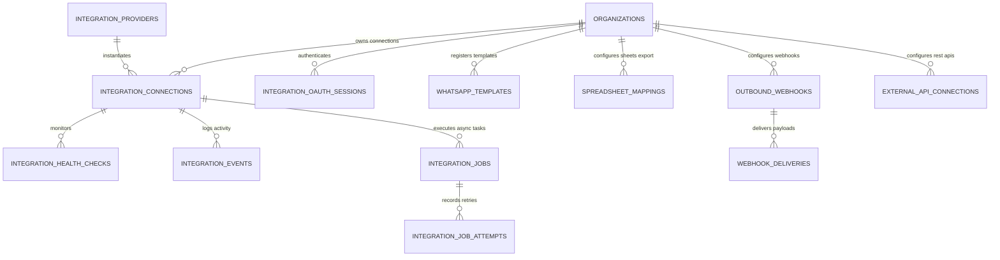

# Hiren Beyond Backend — Task 15: External Integrations, Google Calendar, Google Meet, WhatsApp Business, Google Sheets, Webhooks & Integration Connections

## 1. Executive Summary

Task 15 delivers the centralized **Integration & External Connections Layer** for the **Hiren Beyond** AI-powered recruitment platform. Rather than fragmented, vendor-specific integrations scattered across different modules, this implementation establishes a unified provider-adapter architecture connecting Google Calendar, Google Meet, Microsoft Outlook Calendar, WhatsApp Business Cloud API, Google Sheets, HMAC-signed Outbound Webhooks, and Inbound Webhooks.

### Architectural Pillars:
* **Single Unified Adapter Layer:** Core recruitment workflows interact with high-level provider interfaces (`CalendarProvider`, `MeetingProvider`, `MessagingProvider`, `SpreadsheetProvider`), decoupling database transactions from third-party vendor APIs.
* **Non-Invasiveness & Failure Isolation:** The internal database remains the single source of truth. If Google Calendar, Meta WhatsApp, or an external webhook endpoint times out or fails (5xx, 429), the underlying recruitment entities (e.g., scheduled interviews, applications, jobs) remain completely intact and authoritative; failed integration jobs are isolated, logged, and queued for retry.
* **Zero-Secret Database Exposure:** Raw OAuth access tokens, refresh tokens, client secrets, and signing keys are **never** stored in plaintext table columns and are never returned across frontend API queries. The database stores opaque `credential_reference` identifiers linked to server-side KMS/Vault storage.
* **Strict Multi-Tenant & User-Level Scoping:** Supports both organization-wide integrations (e.g., company ATS webhooks, organization Google Sheets exports) and user-private integrations (e.g., a recruiter's personal Google Calendar), enforced by PostgreSQL Row-Level Security (RLS).
* **Cryptographic Anti-CSRF & Anti-Replay Defense:** OAuth flows utilize unpredictable 64-character hex state tokens with strict 15-minute expiration and one-time consumption. Inbound webhooks enforce unique constraints on `(provider, external_event_id)` and verify SHA256 HMAC signatures before ingestion.
* **Durable Idempotency:** Calendar synchronization, WhatsApp message dispatch, and spreadsheet exports require unique idempotency keys (`idempotency_key UNIQUE`), preventing duplicate calendar events or double-billing during retries.

All components are deployed and verified on the live remote Supabase PostgreSQL database (`pthkmkwrqjyseonysjzu`), with all 26 end-to-end automated test scenarios passing in safe transaction rollbacks.

---

## 2. Architecture & Data Model (13 Tables)

### Table Catalog

| # | Table Name | Purpose & Structure | Security / Integrity Constraint |
|---|---|---|---|
| 1 | `public.integration_providers` | Registry of supported third-party providers (Google, Microsoft, Meta, Webhooks) | `UNIQUE(key)`, active status check, readable by authenticated users |
| 2 | `public.integration_connections` | Connected tenant and user external accounts with scopes, health, and credentials | Scoped by `organization_id` & `user_id`, RLS tenant-isolated |
| 3 | `public.integration_oauth_sessions` | Anti-CSRF OAuth state tracking with expiration and PKCE code verifiers | `UNIQUE(state)`, 15-min TTL, one-time consumption |
| 4 | `public.integration_health_checks` | Connectivity, latency, and token validity telemetry logs | Cascade delete on connection, RLS organization-scoped |
| 5 | `public.integration_events` | Normalized audit stream of integration actions across modules | Scoped by `organization_id`, indexed by `(organization_id, occurred_at DESC)` |
| 6 | `public.integration_jobs` | Asynchronous task queue for external API dispatch and batch exports | `idempotency_key UNIQUE`, retry policy JSONB, status tracking |
| 7 | `public.integration_job_attempts` | Granular attempt history with failure classification (`temporary_failure`, `permanent_failure`) | Linked to job, tracks latency and response metadata |
| 8 | `public.whatsapp_templates` | Registered WhatsApp Business message templates with language codes and variable schema | `UNIQUE(organization_id, name, language_code)`, RLS org-scoped |
| 9 | `public.spreadsheet_mappings` | Google Sheets column mappings and privacy rules (`exclude_private_notes`) | RLS org-scoped, linked to integration connection |
| 10 | `public.outbound_webhooks` | Configured outgoing HTTP webhook endpoints with subscribed events and HMAC secret refs | RLS org-scoped, secret stored as secure reference |
| 11 | `public.webhook_deliveries` | Audited delivery queue for outbound webhooks with SHA256 HMAC signatures | `idempotency_key UNIQUE`, HTTP response status and timing |
| 12 | `public.incoming_webhook_events` | Idempotent ingest table for third-party webhook callbacks | `UNIQUE(provider, external_event_id)` anti-replay defense |
| 13 | `public.external_api_connections` | Generalized REST API connector configurations (`oauth`, `api_key`, `bearer`, `basic`) | RLS org-scoped, secret stored as secure reference |

---

## 3. Core Stored Procedures & Engine Functions

1. **`public.start_oauth_session(...)`**
   - Generates cryptographically unpredictable 64-character hex state tokens (`extensions.gen_random_bytes(32)`).
   - Enforces 15-minute expiration and associates tenant, user, provider, and requested scopes.
2. **`public.complete_oauth_session(...)`**
   - Validates state token exists, is pending, and has not expired.
   - Enforces scope verification: ensures all required scopes were granted by the user.
   - Creates or updates `integration_connections`, transitions session to `completed` (anti-replay), and writes to `public.audit_logs`.
3. **`public.test_integration_connection(...)`**
   - Verifies provider health and records round-trip latency in `integration_health_checks`.
4. **`public.disconnect_integration(...)`**
   - Sets connection status to `disconnected`, cancels pending jobs, and audits the event without deleting internal recruitment data.
5. **`public.sync_interview_calendar_event(...)`**
   - Bridges Task 09 Interview Scheduling with Google/Microsoft Calendar.
   - Handles `create`, `update` (reschedule), and `cancel` actions with idempotency checks.
   - Preserves `calendar_event_id` during reschedules.
   - If external provider fails, the interview remains scheduled while an isolated failure job is logged for retry.
6. **`public.send_whatsapp_message(...)`**
   - Bridges WhatsApp Business messaging into Task 11 `notification_deliveries` under `channel = 'whatsapp'`.
7. **`public.export_data_to_sheets(...)`**
   - Asynchronously stages candidate, application, or job data for Google Sheets.
   - Enforces data privacy by automatically excluding internal recruiter notes and candidate evaluation feedback.
8. **`public.dispatch_outbound_webhook(...)`**
   - Dispatches events to active outbound webhooks, signing each payload with a computed SHA256 HMAC signature header (`sha256=...`).
9. **`public.process_incoming_webhook(...)`**
   - Verifies external HMAC signatures and prevents replay attacks via `UNIQUE(provider, external_event_id)`.

---

## 4. End-to-End Verification Test Suite

All 26 verification scenarios in [test-integrations.sql](file:///e:/New%20Downloads/Backend%20Project/docs/backend/test-integrations.sql) were executed against the remote Supabase database (`pthkmkwrqjyseonysjzu`), passing with 100% success in a safe, isolated transaction rollback:

| Test # | Test Scenario | Verified Behavior | Status |
|:---:|---|---|:---:|
| **01** | Provider Registration & Active Status | `google_calendar` and `whatsapp_business` providers exist and are active in catalog | **PASS** |
| **02** | Organization Connection (OAuth Flow) | Full OAuth initiation and callback creates active connection with encrypted secret ref | **PASS** |
| **03** | Multi-Tenant Connection Isolation | Recruiter B in Org B is strictly blocked from viewing or accessing Org A connections | **PASS** |
| **04** | User-Level Connection Isolation | Recruiter A personal calendar connection is private to Recruiter A and hidden from Org B | **PASS** |
| **05** | OAuth State Replay Defense | Replaying a previously completed or invalid OAuth state token is strictly rejected | **PASS** |
| **06** | Scope Validation & Enforcement | Callback attempting to activate connection with missing required scopes is rejected | **PASS** |
| **07** | Connection Health Telemetry | Valid connection health check records latency (95ms) and updates success timestamp | **PASS** |
| **08** | Expired Connection Handling | Expired connection status is accurately identified and flagged in health monitoring | **PASS** |
| **09** | Disconnect Integration Lifecycle | Disconnection transitions status, halts queued jobs, and audits event | **PASS** |
| **10** | Idempotent Calendar Event Creation | Duplicate sync calls for the same interview return `already_processed` with single event ID | **PASS** |
| **11** | Calendar Failure Isolation | External Google Calendar outage leaves internal interview scheduled; logs retryable job | **PASS** |
| **12** | Interview Reschedule Sync | Rescheduling interview updates scheduled times while preserving existing `calendar_event_id` | **PASS** |
| **13** | Interview Cancellation Sync | Interview cancellation triggers external calendar event cancellation | **PASS** |
| **14** | WhatsApp Business Message Routing | WhatsApp message routes through Task 11 `notification_deliveries` with provider ID | **PASS** |
| **15** | WhatsApp Delivery Failure Tracking | Invalid destination phone number triggers clean failure tracking without crashing caller | **PASS** |
| **16** | Google Sheets Export Mapping & Rows | Creates spreadsheet mapping and stages correct row counts for asynchronous export | **PASS** |
| **17** | Sheets Privacy Guard | Internal recruiter notes and private feedback are strictly stripped from sheet exports | **PASS** |
| **18** | Sheets Export Idempotency | Retrying identical export batch returns `already_queued_or_completed` without duplicate rows | **PASS** |
| **19** | Outbound Webhook HMAC Signing | Outbound webhook delivery generates cryptographically valid SHA256 HMAC signature header | **PASS** |
| **20** | Inbound Webhook Replay Defense | Duplicate incoming external event ID is detected and ignored, preventing double-processing | **PASS** |
| **21** | Invalid Webhook Signature Rejection | Webhook callback with tampered or invalid HMAC signature is rejected with error | **PASS** |
| **22** | Verified Inbound Webhook Ingestion | Valid provider webhook payload is verified and ingested into `incoming_webhook_events` | **PASS** |
| **23** | Cross-Tenant Webhook Protection | Recruiter B in Org B is unauthorized to trigger or dispatch Org A webhooks | **PASS** |
| **24** | Zero Secret Exposure in API Queries | API responses for available/organization integrations contain no plaintext tokens or keys | **PASS** |
| **25** | Disconnect Preservation | Disconnecting calendar provider preserves all internal interviews, applications, and jobs | **PASS** |
| **26** | Provider Failure Non-Invasiveness | Third-party provider downtime leaves core recruitment database completely uncorrupted | **PASS** |

---

## 5. Security, Multi-Tenancy & Privacy Invariants

| Layer | Implementation | Guarantees |
|---|---|---|
| **RLS Policies** | Row-Level Security enabled on all 13 integration tables | Complete multi-tenant partitioning; organization members can only access their own integrations. |
| **User Scope Protection** | `connection_scope = 'user'` filter in policies and functions | Personal recruiter integrations (e.g. personal calendar) remain invisible to other recruiters. |
| **Zero Secret Storage** | Opaque `credential_reference` | Raw OAuth access/refresh tokens and client secrets are never persisted in ordinary database columns. |
| **Replay & CSRF Defense** | Cryptographic 64-char state + `(provider, external_event_id) UNIQUE` | Prevents OAuth session hijacking and duplicate webhook ingestion. |
| **Privacy Stripping** | `exclude_private_notes = true` by default | Export pipelines automatically purge internal evaluations and private candidate comments. |
