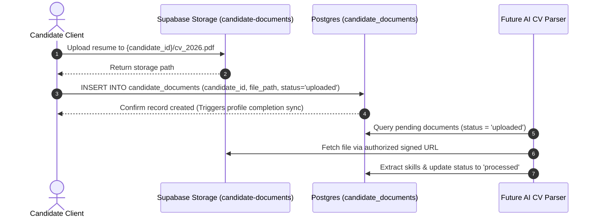

# Hiren Beyond — Candidate Documents & Storage Architecture

## 1. Storage Architecture Overview

Candidate resumes, cover letters, diplomas, and portfolios are managed through **Supabase Storage** coupled with transactional metadata records inside the `public.candidate_documents` table.

File binaries are stored securely in the private `candidate-documents` storage bucket, while relational attributes (document type, MIME type, file size, processing status, and primary flag) are tracked inside PostgreSQL.



---

## 2. Storage Bucket Security

### Bucket Specification
- **Bucket ID**: `candidate-documents`
- **Visibility**: **Private** (`public = false`)
- **File Size Limit**: `20,971,520 bytes` (20 MB)
- **Allowed MIME Types**:
  - `application/pdf`
  - `application/msword`
  - `application/vnd.openxmlformats-officedocument.wordprocessingml.document` (docx)
  - `image/jpeg`
  - `image/png`

### Path Convention
All uploaded documents follow the strict hierarchical path convention:
```text
candidate-documents/{candidate_id}/{filename}
```

---

## 3. Storage Object RLS Policies

Storage objects are protected by Row Level Security on `storage.objects`:

- **`candidate_storage_select` (SELECT)**:
  Permitted if caller owns the candidate directory (`SPLIT_PART(name, '/', 1) = candidate_id`), is an authorized recruiter with `candidates.read`, or is a platform administrator.
- **`candidate_storage_insert` (INSERT)**:
  Permitted only if caller owns the candidate directory or holds `platform_admin`.
- **`candidate_storage_update` / `candidate_storage_delete` (UPDATE / DELETE)**:
  Restricted to candidate owner or platform administrator.

---

## 4. Metadata Schema (`candidate_documents`)

| Column | Type | Description |
|---|---|---|
| `id` | `UUID` | Primary key |
| `candidate_id` | `UUID` | Foreign key referencing `candidates.id` |
| `document_type` | `TEXT` | `cv`, `resume`, `cover_letter`, `certificate`, `portfolio`, `other` |
| `file_path` | `TEXT` | Relative storage path (e.g. `c032a.../resume.pdf`) |
| `original_file_name` | `TEXT` | Original uploaded filename |
| `mime_type` | `TEXT` | File media type |
| `file_size` | `BIGINT` | Size in bytes |
| `storage_bucket` | `TEXT` | Bucket identifier (`candidate-documents`) |
| `status` | `TEXT` | `uploaded`, `processing`, `processed`, `failed`, `archived` |
| `is_primary` | `BOOLEAN` | Flags primary resume for applications & quick search |
| `uploaded_at` | `TIMESTAMPTZ` | Timestamp when upload finished |

---

## 5. Preparation for Future AI CV Extraction & Matching

The document model is engineered to support Phase 3 AI features without requiring schema restructuring:
1. **Asynchronous Processing Pipeline**:
   The `status` enum (`uploaded` -> `processing` -> `processed` / `failed`) enables asynchronous queue workers or Supabase Edge Functions to safely poll or listen via Webhooks for newly uploaded resumes.
2. **Provenance Tracking**:
   Skills and languages extracted from a CV are flagged with `source = 'cv_extraction'`, retaining an audit trail between the raw document and extracted competency data.
3. **Signed Download URLs**:
   Because the bucket is private, external AI workers access file payloads using short-lived signed URLs generated through Supabase Storage APIs, preventing persistent public exposures.
