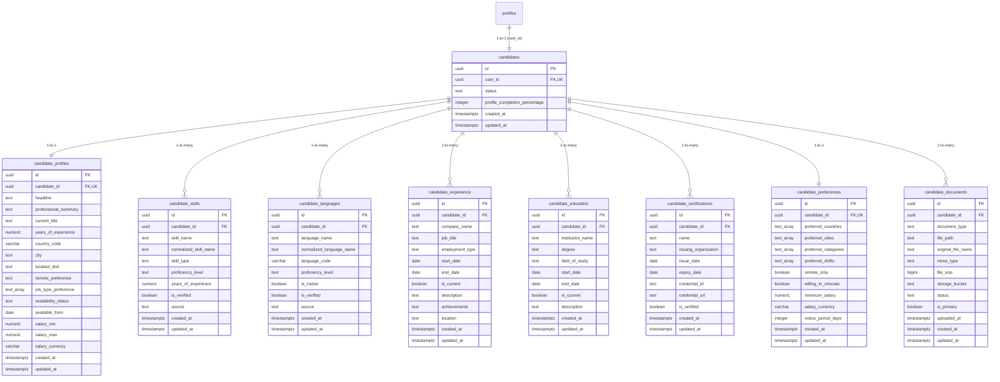

# Hiren Beyond — Candidate Domain Architecture

## 1. Domain Overview

The Candidate Domain is the foundational core of the **Hiren Beyond** AI-powered career and recruitment platform. It captures candidate identities, professional achievements, verified competencies, linguistic fluencies, preferences, career milestones, and portfolio assets.

The candidate model is designed with strict normalization to empower:
- High-performance multi-criteria search (e.g. *French speakers in Egypt open to relocation*).
- Algorithmic and AI candidate-job matching.
- Objective CV parsing and qualification extraction.
- Continuous profile completion telemetry.

---

## 2. Entity Relationship Diagram

---

## 3. Data Dictionary

### A. `candidates`
Root anchor linking an authenticated user to recruitment operations.
- `id` (`UUID`): Primary key.
- `user_id` (`UUID`): Foreign key referencing `profiles.id` (`ON DELETE CASCADE`), with a `UNIQUE` constraint ensuring one primary candidate identity per account.
- `status`: `active`, `inactive`, `suspended`, `archived`.
- `profile_completion_percentage`: Dynamically computed integer (`0`–`100`).

### B. `candidate_profiles`
Biographical and work orientation summary.
- `remote_preference`: `remote`, `hybrid`, `on_site`, `flexible`.
- `job_type_preference`: Array supporting `full_time`, `part_time`, `contract`, `freelance`, `temporary`, `internship`.
- `availability_status`: `immediately`, `within_two_weeks`, `within_one_month`, `not_available`, `open_to_discussion`.
- `salary_min` & `salary_max`: Numeric bounds with constraint `salary_max >= salary_min`.

### C. `candidate_skills`
Normalized competencies.
- `normalized_skill_name`: Lowercased, whitespace-stripped canonical name.
- `skill_type`: `technical`, `soft`, `industry`, `tool`, `domain`, `other`.
- `proficiency_level`: `beginner`, `intermediate`, `advanced`, `expert`, `unknown`.
- `source`: `candidate`, `cv_extraction`, `recruiter`, `assessment`, `ai_suggestion`.
- `is_verified`: Boolean. **Constraint Rule**: AI suggestions cannot be verified automatically (`CHECK (NOT (source = 'ai_suggestion' AND is_verified = true))`).

### D. `candidate_languages`
Multilingual qualifications.
- `language_code`: ISO language code (e.g. `en`, `ar`, `fr`, `de`).
- `proficiency_level`: Standardized to CEFR framework (`a1`, `a2`, `b1`, `b2`, `c1`, `c2`, `native`, `unknown`).
- **Constraint Rule**: Unique per candidate and language code; AI suggestions cannot be automatically marked as verified.

### E. `candidate_experience`
Chronological employment records.
- Enforces `end_date >= start_date`.
- Enforces consistency between `is_current = true` and `end_date IS NULL`.

### F. `candidate_education`
Academic history with start/end date validation.

### G. `candidate_certifications`
Credentials and licenses with expiry date verification.

### H. `candidate_preferences`
Relocation readiness, shift flexibility, target compensation, and notice periods.

---

## 4. Profile Completion Engine

Profile completeness is calculated dynamically by the database function:
`public.calculate_candidate_profile_completion(candidate_uuid UUID) RETURNS INTEGER`

### Scoring Weights:
1. **Candidate Profile (25%)**: Complete headline, professional summary, and current title.
2. **Primary CV Upload (20%)**: At least one active CV/resume document registered.
3. **Skills Inventory (15%)**: At least 3 skills entered (5% per skill up to 15%).
4. **Language Fluency (10%)**: At least 1 registered language.
5. **Employment History (15%)**: At least 1 valid work experience entry.
6. **Academic Background (10%)**: At least 1 educational qualification.
7. **Career Preferences (5%)**: Relocation and compensation preferences configured.

**Automated Synchronization**:
The `sync_candidate_profile_completion()` trigger fires automatically on `AFTER INSERT OR UPDATE OR DELETE` across all candidate sub-entities, continuously updating `candidates.profile_completion_percentage` and `candidates.updated_at`.
