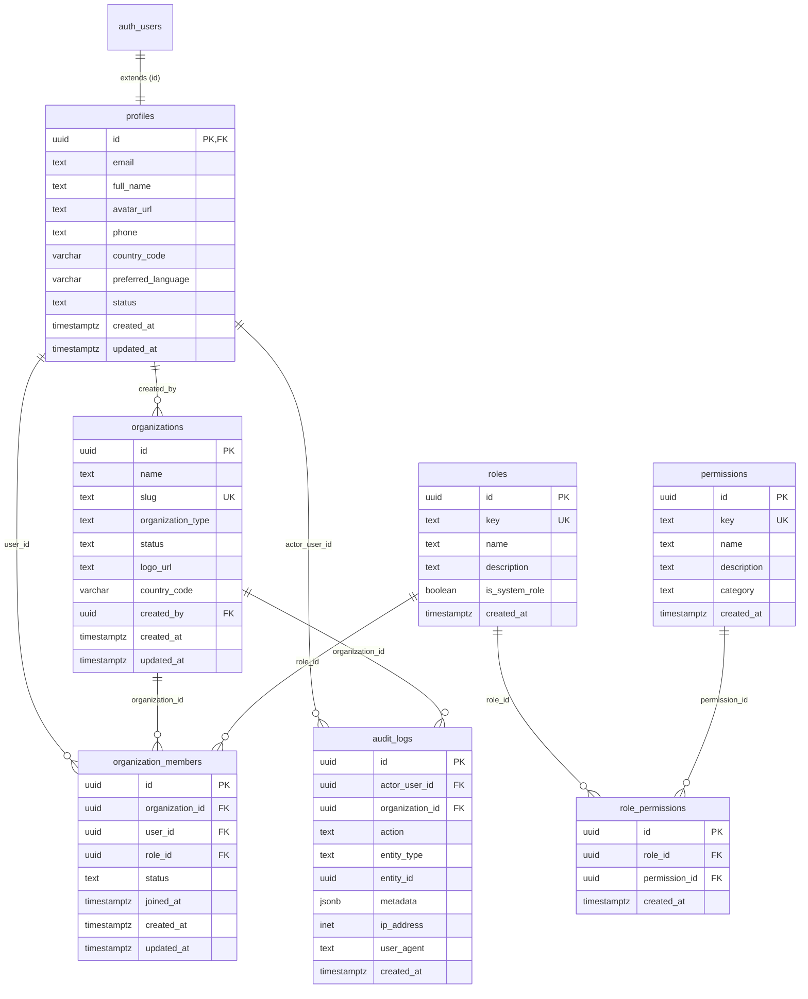

# Hiren Beyond — Database Schema Reference

## Overview
All tables reside within the `public` schema in Supabase PostgreSQL and enforce Row Level Security (RLS). Every primary key uses UUID generation, and all state-mutating tables maintain automatic timestamp triggers.

---

## Entity Relationship Diagram

---

## Tables & Specifications

### 1. `profiles`
Extends `auth.users` with application-specific demographic and preference data.

| Column | Type | Constraints | Description |
|---|---|---|---|
| `id` | `UUID` | `PRIMARY KEY`, `REFERENCES auth.users(id) ON DELETE CASCADE` | Matches Supabase Auth user ID |
| `email` | `TEXT` | `NOT NULL` | User email address synchronized from Auth |
| `full_name` | `TEXT` | `NULL` | Candidate/member full legal or display name |
| `avatar_url` | `TEXT` | `NULL` | Hosted profile image URL |
| `phone` | `TEXT` | `NULL` | Contact phone number with international dial code |
| `country_code` | `VARCHAR(10)` | `NULL` | ISO country code (e.g. `EG`, `US`, `GB`) |
| `preferred_language` | `VARCHAR(10)` | `NOT NULL DEFAULT 'en'` | UI localization preference (e.g. `en`, `ar`) |
| `status` | `TEXT` | `NOT NULL DEFAULT 'active'`, `CHECK (status IN ('active', 'inactive', 'suspended'))` | Account standing |
| `created_at` | `TIMESTAMPTZ` | `NOT NULL DEFAULT now()` | Record creation timestamp |
| `updated_at` | `TIMESTAMPTZ` | `NOT NULL DEFAULT now()` | Automatic update timestamp |

---

### 2. `organizations`
Represents tenant boundaries across platform administrators, agencies, clients, and partner organizations.

| Column | Type | Constraints | Description |
|---|---|---|---|
| `id` | `UUID` | `PRIMARY KEY DEFAULT gen_random_uuid()` | Unique organization identifier |
| `name` | `TEXT` | `NOT NULL` | Display name of the entity |
| `slug` | `TEXT` | `NOT NULL UNIQUE` | URL-safe slug for subdomains or routing |
| `organization_type` | `TEXT` | `NOT NULL`, `CHECK (organization_type IN ('platform', 'recruitment_agency', 'client', 'partner', 'team'))` | Tenant classification |
| `status` | `TEXT` | `NOT NULL DEFAULT 'active'`, `CHECK (status IN ('active', 'inactive', 'suspended'))` | Operational status |
| `logo_url` | `TEXT` | `NULL` | Entity branding asset URL |
| `country_code` | `VARCHAR(10)` | `NULL` | Headquarters country code |
| `created_by` | `UUID` | `REFERENCES public.profiles(id) ON DELETE SET NULL` | Profile ID of creator |
| `created_at` | `TIMESTAMPTZ` | `NOT NULL DEFAULT now()` | Organization creation timestamp |
| `updated_at` | `TIMESTAMPTZ` | `NOT NULL DEFAULT now()` | Automatic update timestamp |

---

### 3. `roles`
Catalog of system and organizational roles for RBAC.

| Column | Type | Constraints | Description |
|---|---|---|---|
| `id` | `UUID` | `PRIMARY KEY DEFAULT gen_random_uuid()` | Unique role identifier |
| `key` | `TEXT` | `NOT NULL UNIQUE` | Programmatic identifier (e.g. `platform_admin`) |
| `name` | `TEXT` | `NOT NULL` | Human-readable role label |
| `description` | `TEXT` | `NULL` | Scope and responsibility summary |
| `is_system_role` | `BOOLEAN` | `NOT NULL DEFAULT true` | Protected system role indicator |
| `created_at` | `TIMESTAMPTZ` | `NOT NULL DEFAULT now()` | Creation timestamp |

---

### 4. `permissions`
Granular authorization capabilities assigned to roles.

| Column | Type | Constraints | Description |
|---|---|---|---|
| `id` | `UUID` | `PRIMARY KEY DEFAULT gen_random_uuid()` | Unique permission identifier |
| `key` | `TEXT` | `NOT NULL UNIQUE` | Programmatic capability token (e.g. `jobs.manage`) |
| `name` | `TEXT` | `NOT NULL` | Human-readable capability name |
| `description` | `TEXT` | `NULL` | Purpose of the permission |
| `category` | `TEXT` | `NOT NULL` | Grouping (e.g. `platform`, `jobs`, `candidates`) |
| `created_at` | `TIMESTAMPTZ` | `NOT NULL DEFAULT now()` | Creation timestamp |

---

### 5. `role_permissions`
Junction table mapping roles to their granted permissions.

| Column | Type | Constraints | Description |
|---|---|---|---|
| `id` | `UUID` | `PRIMARY KEY DEFAULT gen_random_uuid()` | Unique assignment identifier |
| `role_id` | `UUID` | `NOT NULL REFERENCES public.roles(id) ON DELETE CASCADE` | Assigned role |
| `permission_id` | `UUID` | `NOT NULL REFERENCES public.permissions(id) ON DELETE CASCADE` | Granted permission |
| `created_at` | `TIMESTAMPTZ` | `NOT NULL DEFAULT now()` | Assignment timestamp |

*Unique constraint*: `UNIQUE (role_id, permission_id)`.

---

### 6. `organization_members`
Connects user profiles to organizations and binds an active role.

| Column | Type | Constraints | Description |
|---|---|---|---|
| `id` | `UUID` | `PRIMARY KEY DEFAULT gen_random_uuid()` | Membership identifier |
| `organization_id` | `UUID` | `NOT NULL REFERENCES public.organizations(id) ON DELETE CASCADE` | Tenant reference |
| `user_id` | `UUID` | `NOT NULL REFERENCES public.profiles(id) ON DELETE CASCADE` | Profile reference |
| `role_id` | `UUID` | `NOT NULL REFERENCES public.roles(id) ON DELETE RESTRICT` | Assigned tenant role |
| `status` | `TEXT` | `NOT NULL DEFAULT 'active'`, `CHECK (status IN ('active', 'invited', 'suspended', 'left'))` | Membership status |
| `joined_at` | `TIMESTAMPTZ` | `DEFAULT now()` | Timestamp when invitation was accepted |
| `created_at` | `TIMESTAMPTZ` | `NOT NULL DEFAULT now()` | Creation timestamp |
| `updated_at` | `TIMESTAMPTZ` | `NOT NULL DEFAULT now()` | Automatic update timestamp |

*Unique constraint*: `UNIQUE (organization_id, user_id)`.

---

### 7. `audit_logs`
Immutable record of security-critical and operational events.

| Column | Type | Constraints | Description |
|---|---|---|---|
| `id` | `UUID` | `PRIMARY KEY DEFAULT gen_random_uuid()` | Audit log identifier |
| `actor_user_id` | `UUID` | `REFERENCES public.profiles(id) ON DELETE SET NULL` | Performing user profile |
| `organization_id` | `UUID` | `REFERENCES public.organizations(id) ON DELETE SET NULL` | Scoped tenant (NULL for global events) |
| `action` | `TEXT` | `NOT NULL` | Performed action verb (e.g. `user.invited`, `job.published`) |
| `entity_type` | `TEXT` | `NOT NULL` | Target resource type (e.g. `organization`, `job`, `member`) |
| `entity_id` | `UUID` | `NULL` | Identifier of affected resource |
| `metadata` | `JSONB` | `NOT NULL DEFAULT '{}'::jsonb` | Contextual payload (no sensitive secrets) |
| `ip_address` | `INET` | `NULL` | Client IP address if safely captured |
| `user_agent` | `TEXT` | `NULL` | Client user agent string |
| `created_at` | `TIMESTAMPTZ` | `NOT NULL DEFAULT now()` | Event emission timestamp |
