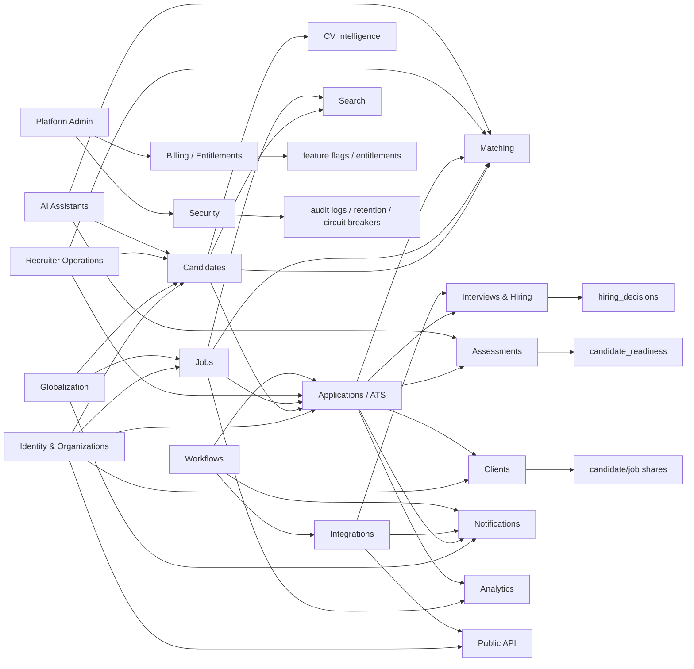

# Cross-Module Relationships

This is an architectural dependency map, not a complete foreign-key inventory.

## Important Boundaries

| Boundary | Rule |
|---|---|
| Identity to everything | `profiles`, `organizations`, and memberships provide user and tenant context. |
| Candidates to clients | Clients see only explicit shares, not full candidate records by default. |
| Jobs to marketplace | Published jobs can be public; draft/admin job data remains org-scoped. |
| Applications to ATS | Applications are the central join between jobs and candidates. |
| AI to business domains | AI may recommend or prepare actions, but authorization is still backend-enforced. |
| Public API to internal data | API keys/scopes/rate limits mediate external access. |
| Workflows to actions | Workflow configuration must use approved action types only. |

