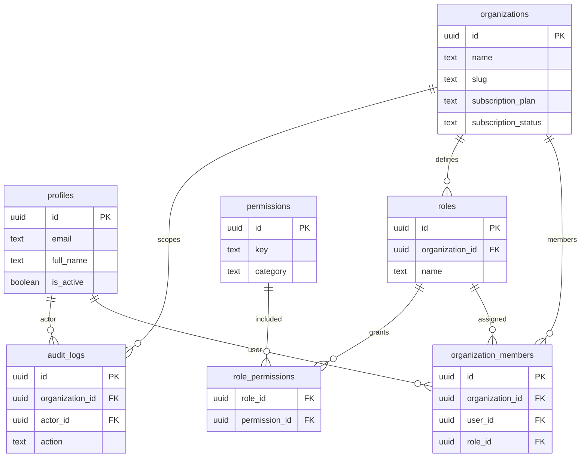

# 01 Identity & Organizations

Owns tenant identity, user profiles, roles, permissions, and membership.

External dependencies: Supabase Auth users.

Layout note: keep `organizations` and `profiles` at the top, membership/roles in the middle, and audit logs below.

