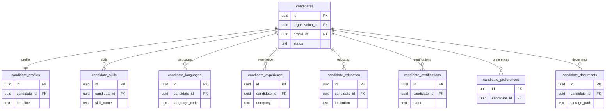

# 02 Candidates

Owns canonical candidate records and structured profile data.

External dependencies: `profiles`, `organizations`, Globalization reference tables.

Related but owned elsewhere: `candidate_availability` is shown in Interviews; `candidate_readiness` is shown in Assessments; CV extraction tables are shown in CV Intelligence.

