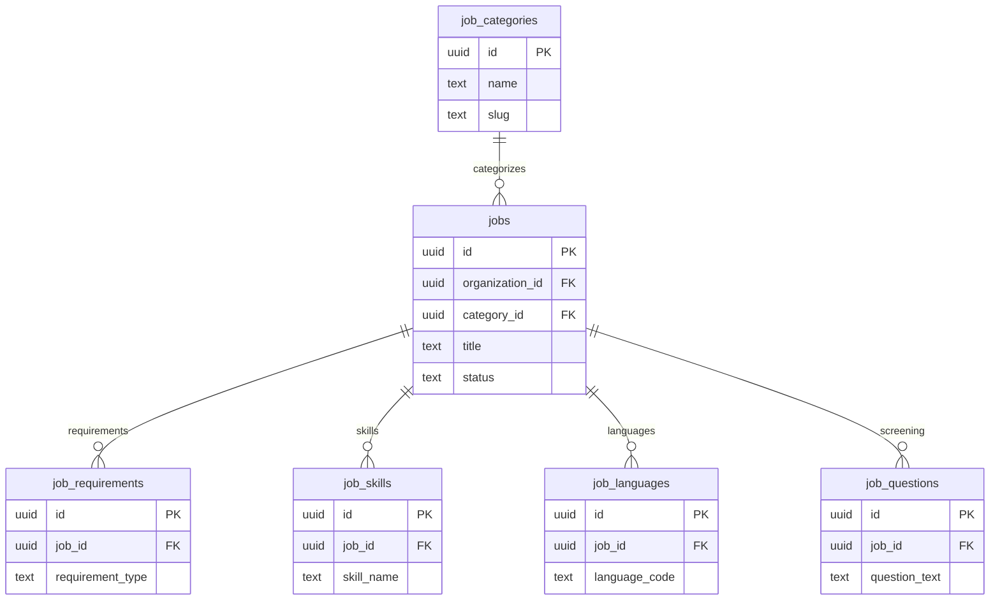

# 03 Jobs

Owns job postings, requirements, marketplace metadata, and job search inputs.

External dependencies: `organizations`, Globalization reference tables.

Related but owned elsewhere: `job_assessments` is in Assessments, `job_daily_metrics` in Analytics, and `job_search_documents` in Search.

