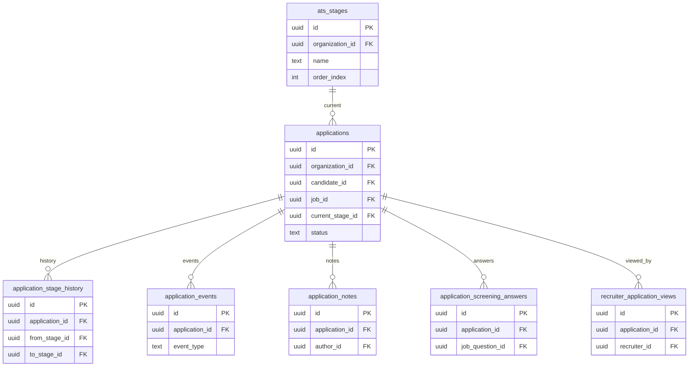

# 04 Applications / ATS

Owns the core candidate-to-job application and ATS pipeline.

External dependencies: `candidates`, `jobs`, `profiles`, `organizations`.

Related but owned elsewhere: assessments, interviews, matching, and client shares all depend on `applications`.

