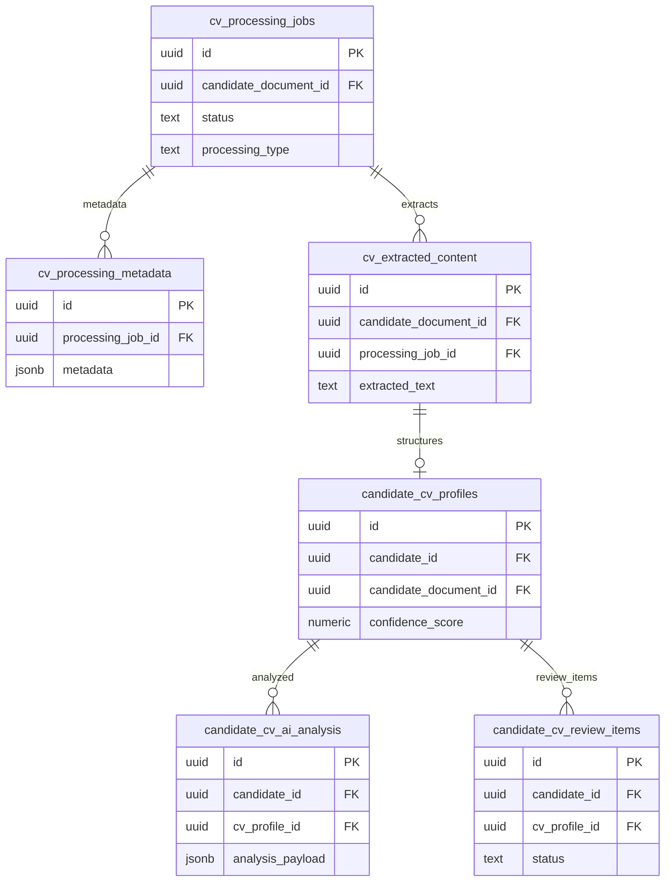

# 05 CV Intelligence

Owns CV processing, extraction, AI analysis, and human review records.

External dependencies: `candidate_documents`, `candidates`, storage bucket `candidate-documents`.

Layout note: show the pipeline left-to-right as processing job, extracted content, structured profile, AI analysis, review.

