# 06 Matching

Owns scoring configuration, run outputs, explanations, overrides, and shared skill aliases.

External dependencies: `jobs`, `candidates`, `applications`, recruiter/user context.

```mermaid
erDiagram
    matching_profiles {
        uuid id PK
        uuid organization_id FK
        text name
        jsonb dimension_weights
    }
    match_criteria {
        uuid id PK
        uuid matching_profile_id FK
        text criteria_type
    }
    matching_runs {
        uuid id PK
        uuid job_id FK
        uuid matching_profile_id FK
        text status
    }
    match_dimension_results {
        uuid id PK
        uuid matching_run_id FK
        uuid candidate_id FK
        text dimension
    }
    match_explanations {
        uuid id PK
        uuid matching_run_id FK
        uuid candidate_id FK
        numeric total_score
    }
    match_overrides {
        uuid id PK
        uuid matching_run_id FK
        uuid overridden_by FK
    }
    skill_aliases {
        uuid id PK
        text canonical_skill
        text alias
    }

    matching_profiles ||--o{ match_criteria : criteria
    matching_profiles ||--o{ matching_runs : configures
    matching_runs ||--o{ match_dimension_results : dimension_scores
    matching_runs ||--o{ match_explanations : explanations
    matching_runs ||--o{ match_overrides : overrides
```

Talent pool tables are shown in Recruiter Operations because they are recruiter workflow objects built on matching/search outputs.

