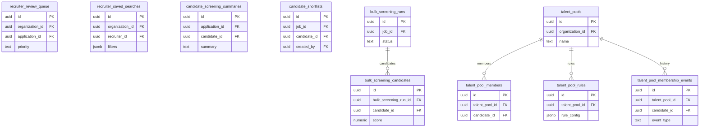

# 07 Recruiter Operations

Owns recruiter-facing queues, saved searches, shortlists, bulk screening, and talent pools.

External dependencies: `applications`, `jobs`, `candidates`, Matching.

Keep review queues and saved searches separate from pool membership to reduce line crossings.

