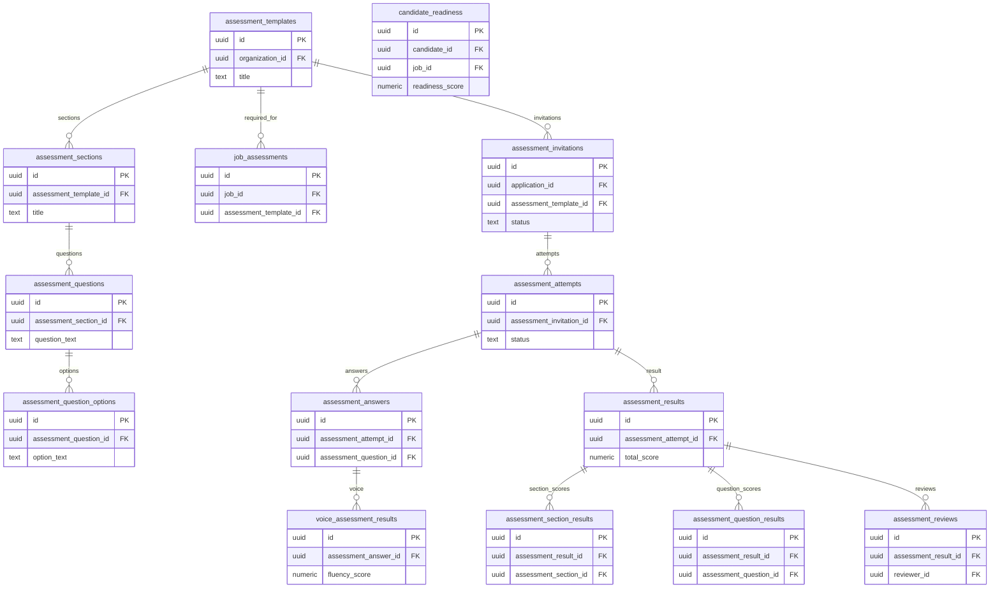

# 08 Assessments

Owns assessment templates, invitations, attempts, answers, scoring outputs, reviews, voice results, and candidate readiness.

External dependencies: `applications`, `jobs`, `candidates`, storage bucket `assessment-audio`.

