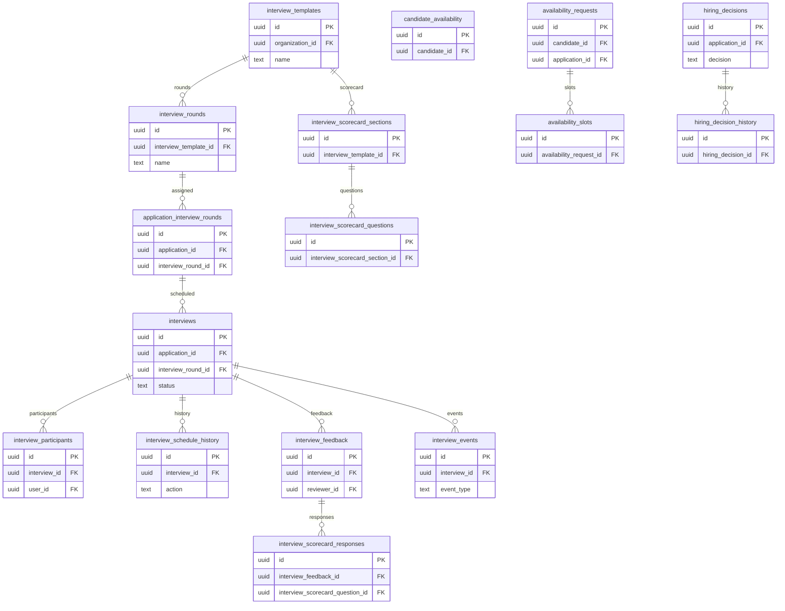

# 09 Interviews & Hiring

Owns interview templates, rounds, scheduling, participants, availability, feedback, scorecards, events, and hiring decisions.

External dependencies: `applications`, `candidates`, `profiles`.

