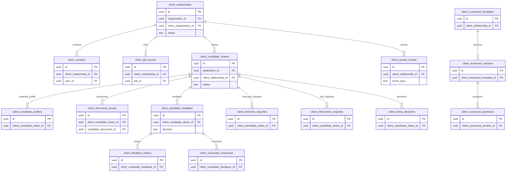

# 10 Clients

Owns client portal relationships, access grants, candidate shares, feedback, scorecards, information requests, interview requests, hiring decisions, and activity.

External dependencies: `organizations`, `jobs`, `applications`, `candidates`, `candidate_documents`.

