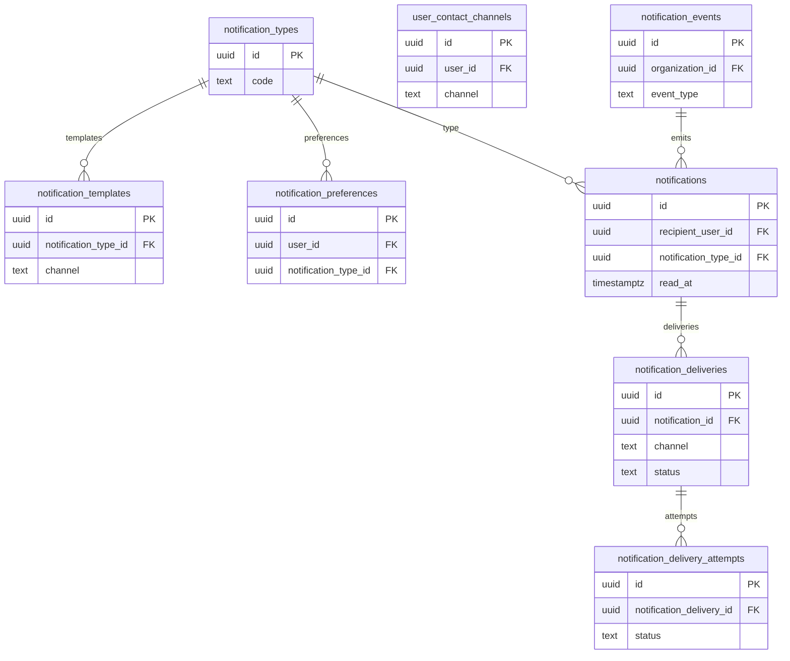

# 11 Notifications

Owns notification templates, preferences, events, in-app notifications, delivery records, and attempts.

External dependencies: `profiles`, `organizations`, application/interview/assessment event sources.

