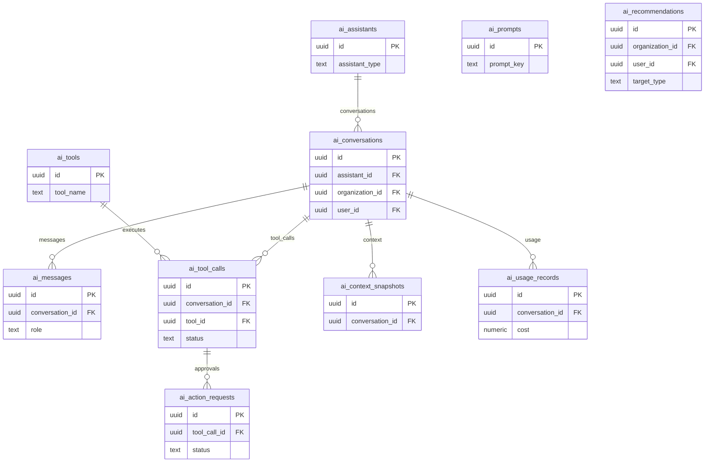

# 12 AI Assistants

Owns assistants, conversations, messages, tools, tool calls, approval requests, context snapshots, prompts, recommendations, and usage records.

External dependencies: `organizations`, `profiles`, business target records.

AI output must remain advisory; authorization and high-risk action approval stay server-side.

