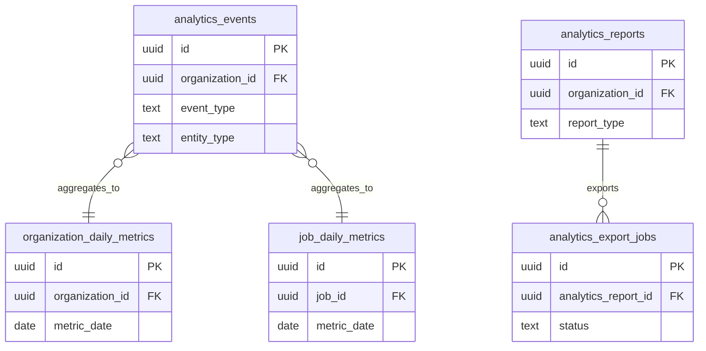

# 13 Analytics

Owns event capture, daily metrics, report definitions, and export jobs.

External dependencies: jobs, applications, candidates, clients, storage bucket `analytics-exports`.

Storage note: generated exports belong in the private `analytics-exports` bucket.

