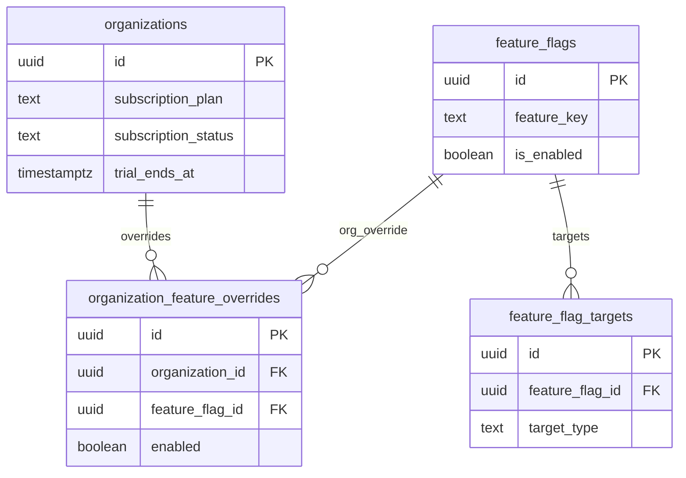

# 14 Billing / Entitlements

Billing is currently represented by subscription fields and feature entitlement tables, not a full payment-provider schema.

External dependencies: `organizations`, Platform Admin.

Missing from local migrations: checkout sessions, invoices, payment customers, subscriptions table, and customer portal runtime. Treat billing as entitlement primitives until those are implemented or verified elsewhere.

