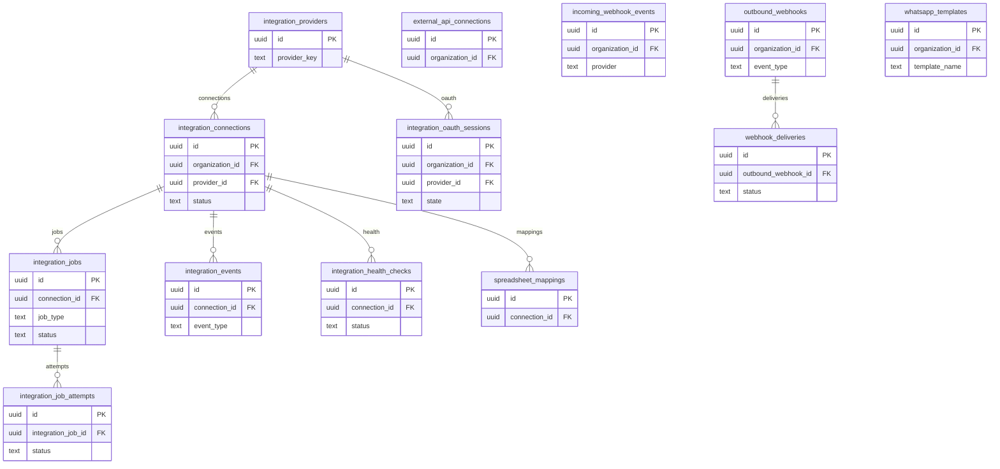

# 15 Integrations

Owns integration providers, connections, OAuth sessions, jobs, attempts, events, health checks, webhooks, and spreadsheet mappings.

External dependencies: organizations, profiles, notifications, interviews/calendar, public API.

