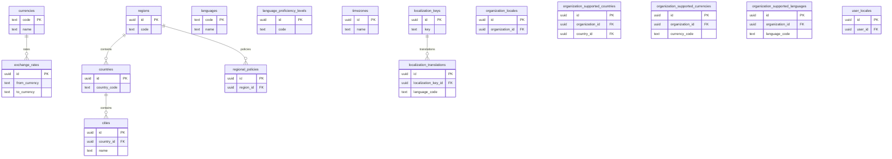

# 16 Globalization

Owns reference geography, currency, language, timezone, translation, locale, and regional policy data.

External dependencies: `organizations`, `profiles`.

```mermaid
erDiagram
    regions {
        uuid id PK
        text code
    }
    countries {
        uuid id PK
        text country_code
    }
    cities {
        uuid id PK
        uuid country_id FK
        text name
    }
    currencies {
        text code PK
        text name
    }
    exchange_rates {
        uuid id PK
        text from_currency
        text to_currency
    }
    languages {
        text code PK
        text name
    }
    language_proficiency_levels {
        uuid id PK
        text code
    }
    timezones {
        uuid id PK
        text name
    }
    localization_keys {
        uuid id PK
        text key
    }
    localization_translations {
        uuid id PK
        uuid localization_key_id FK
        text language_code
    }
    regional_policies {
        uuid id PK
        uuid region_id FK
    }
    organization_locales {
        uuid id PK
        uuid organization_id FK
    }
    organization_supported_countries {
        uuid id PK
        uuid organization_id FK
        uuid country_id FK
    }
    organization_supported_currencies {
        uuid id PK
        uuid organization_id FK
        text currency_code
    }
    organization_supported_languages {
        uuid id PK
        uuid organization_id FK
        text language_code
    }
    user_locales {
        uuid id PK
        uuid user_id FK
    }

    regions ||--o{ countries : contains
    countries ||--o{ cities : contains
    currencies ||--o{ exchange_rates : rates
    localization_keys ||--o{ localization_translations : translations
    regions ||--o{ regional_policies : policies
```

