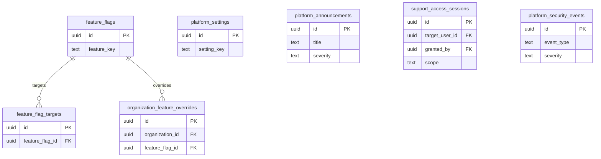

# 17 Platform Admin

Owns platform settings, feature flags, announcements, support sessions, and platform security event views.

External dependencies: Identity, Security, Billing entitlements.

Support access must remain time-boxed and audited.

