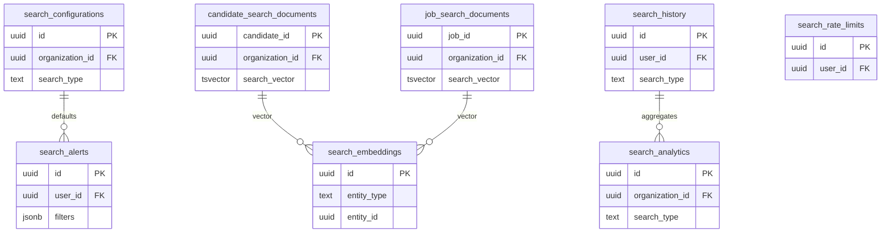

# 18 Search

Owns search configurations, search documents, embeddings, history, analytics, rate limits, and alerts.

External dependencies: candidates, jobs, applications, talent pools.

AI-generated filters must be validated before search RPCs execute.

