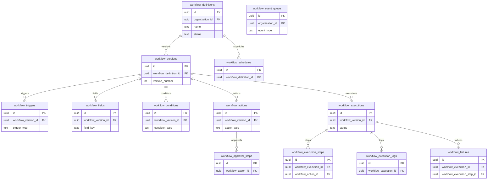

# 19 Workflows

Owns workflow definitions, versions, triggers, fields, conditions, actions, approvals, schedules, queueing, executions, steps, logs, and failures.

External dependencies: organizations, profiles, applications, notifications, integrations.

Workflow configuration must never expose arbitrary SQL, arbitrary code execution, or arbitrary unapproved HTTP actions to the frontend.

