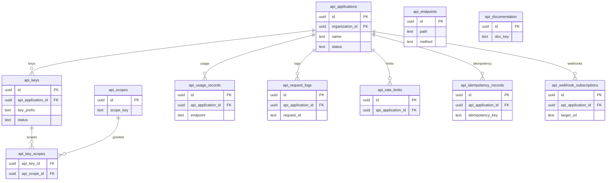

# 20 Public API

Owns external API applications, keys, scopes, usage, request logs, rate limits, endpoint catalog, idempotency, webhook subscriptions, and documentation metadata.

External dependencies: organizations, jobs, candidates, applications.

Note: local migrations implement the database API layer and OpenAPI documentation. No `supabase/functions` directory is present in this repository snapshot.

