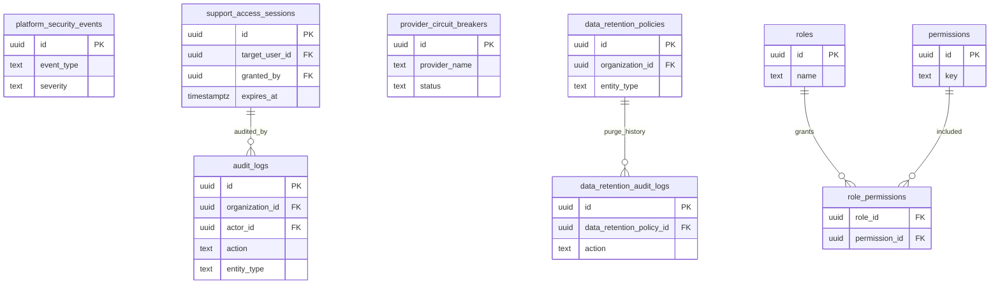

# 21 Security

Security is cross-cutting. This diagram collects audit, retention, circuit breaker, RLS support, and support access structures.

External dependencies: all modules.

RLS policies are defined in the module migrations. This diagram intentionally does not duplicate every policy.

