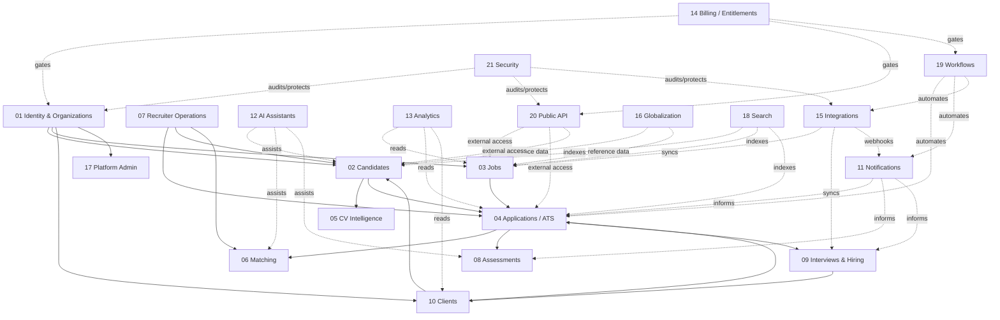

# Master ERD

High-level, intentionally simplified ERD. Detailed table-level diagrams live in `docs/database/erd`.

## Design Notes

- The production database remains in `public`; these are logical boundaries.
- Shared tables are not duplicated in every detailed ERD.
- Cross-cutting modules are connected only where they are architecturally meaningful.

